# #zingChart

<p align="center"></p>

[Tiếng Việt](README.md) · [English](README.en.md) · [简体中文](README.zh-CN.md)

Tài liệu được duy trì bằng ba ngôn ngữ trên. UI Flutter hiện mặc định tiếng
Việt; các widget/remote native tự chọn nhãn tiếng Việt, English hoặc 简体中文
theo ngôn ngữ hệ điều hành.

#zingChart là ứng dụng bảng xếp hạng và trình phát nhạc Local-First viết bằng
Flutter. Một codebase phục vụ Android, Android TV, iOS, Web/PWA, Windows,
macOS, Linux, Amazon Fire OS/Fire TV, LG webOS TV, Samsung Tizen TV và
HarmonyOS phone/tablet.

Client không gọi trực tiếp upstream Zing. Tất cả dữ liệu chart và audio đi qua
proxy Node/TypeScript do người triển khai tự host.

## 1. Tính năng hiện tại

- Zing Chart realtime: thứ hạng, biến động tăng/giảm, ảnh bìa, tên bài, nghệ
  sĩ, album và thời lượng theo đúng metadata chart; biểu đồ 24 giờ tương tác
  bằng hover, chạm/kéo, bàn phím hoặc remote TV, có tooltip tỷ lệ và phát trực
  tiếp bài đang chọn. Chart tự làm mới nền mỗi hai phút khi đang hiển thị, giữ
  dữ liệu cũ và cho phép thử lại nếu mạng gián đoạn, đồng thời dừng request khi
  app không hoạt động. Khám phá nhúng thêm preview `#zingchart` gồm đồ thị 24 giờ
  và top 3, phát đúng queue BXH hoặc mở bảng đầy đủ mà không gọi endpoint mới.
  Hàng “Gợi ý” chính thức tải độc lập, bỏ bài trùng BXH,
  có link nghệ sĩ/album mở nội bộ và không gửi favorites, lịch sử hay analytics
  ra khỏi thiết bị. Danh sách mặc
  định bám Zing MP3 với top 10 và nút “Xem top 100”; queue vẫn giữ đủ BXH.
  Từng nghệ sĩ trong danh sách cộng tác và album là link hover/focus mở đúng
  nội dung chính thức; action “Thông tin” mở Song Detail mà không tự phát bài.
  Trong Song Detail, nghệ sĩ, nhạc sĩ và album tiếp tục mở thẳng hồ sơ/nội dung
  nội bộ tương ứng mà không làm gián đoạn bài đang phát hoặc thay đổi queue.
  Ảnh bìa hiện affordance Play/Lock/Now Playing khi hover hoặc focus. Menu bài
  hát được dùng thống nhất cho nút Thêm và chuột phải trên desktop: Phát ngay,
  Thông tin, hàng đợi, Song Radio, playlist, chia sẻ, yêu thích và mood; bài bị
  khóa vẫn xem/lưu được nhưng không lộ thao tác phát, queue hay Radio.
- BXH Nhạc Mới theo dữ liệu phát hành hiện tại: hạng, xu hướng tăng/giảm, album,
  thời lượng và trạng thái quyền phát; layout riêng cho mobile, desktop và TV.
- Bảng Xếp Hạng Tuần chính thức theo Việt Nam, US-UK và K-Pop; ba card khu vực
  nằm ngay trong Khám phá như Zing MP3 và mở thẳng đúng BXH. Màn đầy đủ cho
  chọn tám tuần gần nhất, xem biến động hạng/album/thời lượng và chỉ phát các
  bài được phép.
- Mới Phát Hành theo catalog bài hát/album, có tab như Zing MP3, lọc Tất cả,
  Việt Nam, Âu Mỹ, Hàn Quốc, Khác và queue chỉ gồm bài phát được. Home cũng có
  cụm 12 bài dạng 3 cột như Zing, với lọc Tất cả/Việt Nam/Quốc tế và lối mở
  catalog đầy đủ; mỗi bài dùng cùng menu hành động chuẩn trên mobile, desktop
  và TV, đồng thời hỗ trợ chuột phải trên desktop.
- Khám phá Home có rail danh mục như Zing: Cho bạn, Thư giãn, Làm việc,
  Trending, Ngủ ngon và Tập luyện; mỗi danh mục giữ Quick Play, banner và
  collection rail riêng. Trong lúc chờ mạng, skeleton responsive giữ nguyên
  nhịp Quick Play → banner → bài hát trên mobile, tablet, desktop và TV để nội
  dung không bị nhảy khi tải xong; progress chuyển sang trạng thái tĩnh khi hệ
  điều hành bật Reduce Motion. Trên tablet/desktop, thanh tìm kiếm nối thẳng vào rail
  danh mục và Quick Play; rail danh mục được ghim ngay dưới toolbar khi cuộn,
  còn tiêu đề lớn, lịch sử tìm kiếm và shortcut phụ không đẩy nội dung quan
  trọng xuống dưới vùng đầu màn hình. Desktop rộng dùng sidebar nên không lặp
  lại shortcut trong nội dung; tablet giữ shortcut sau cụm ưu tiên, còn
  mobile/TV giữ thứ tự phù hợp thao tác chạm và remote. Rail Top 100 chính thức
  có lối “TẤT CẢ” vào catalog đầy đủ. Quick Play được trình bày thành hero “Có thể bạn thích”
  như Zing bằng card ngang thấp, artwork vuông bên trái và gradient coral–plum:
  hai thẻ trên desktop/tablet, ba thẻ trên TV rộng và một thẻ có phần
  xem trước trên mobile; nút trang nổi giữa mép card hỗ trợ chuột/bàn phím/remote.
  Banner editorial nằm ngay sau đó dưới dạng một panorama thấp chiếm toàn bộ
  bề rộng: ảnh chính thức được giữ nguyên, không phủ tiêu đề hay nút Play lên
  creative; trên mobile vẫn hé card tiếp theo. Carousel banner tự chuyển khi rảnh như
  Zing MP3, nhưng dừng ngay khi hover, focus hoặc đang vuốt và tắt hoàn toàn
  khi hệ điều hành bật Reduce Motion. Mọi collection rail giữ thao tác vuốt trên
  mobile, tự hiện nút lùi/tiến trên tablet, desktop và TV khi nội dung tràn, đồng
  thời quay về đầu an toàn khi đổi danh mục. Rail “MV Nổi Bật” hiển thị video chính thức
  đã kiểm tra, mở trang Zing trên
  mobile/web/desktop và dùng QR handoff trên TV; app không relay hay tải file MV.
  Card có action deck hover/focus kiểu Zing: thân card mở playlist/album detail,
  Tim lưu/bỏ lưu Local-First, Play phát bài hợp lệ đầu tiên và menu Thêm cho
  phép phát, mở thông tin, lưu hoặc chia sẻ liên kết chính thức; trên desktop,
  chuột phải vào card mở đúng menu hành động này. Queue luôn chỉ gồm các bài
  được phép phát theo đúng thứ tự. Trên các rail Discovery, Hub/Top 100 và
  tab Album Mới Phát Hành, từng nghệ sĩ có định danh là link hover/focus riêng
  mở hồ sơ nội bộ mà không kích hoạt card collection. Proxy
  bỏ qua `adBanner` và không tải mạng quảng cáo bên thứ ba. Cụm “Gợi Ý Bài
  Hát / Làm mới” ưu tiên catalog phát được từ Zing, hiển thị tối đa chín bài
  thành ma trận 3×3 trên desktop/TV và chỉ hiện action deck khi hover/focus;
  mobile luôn có menu Thêm để yêu thích, thêm queue/playlist, mở Thông tin,
  Song Radio hoặc chia sẻ; desktop mở đúng menu này bằng chuột phải và mọi menu
  đều có “Phát ngay” khi bài được phép phát. Metadata chính thức giữ từng nghệ sĩ thành link
  hover/focus mở hồ sơ ngay trong app mà không phát bài hay thay đổi queue.
  Khi dịch vụ không khả dụng, app tự chuyển sang chart
  hiện tại trên thiết bị. Cả hai luồng đều không
  gửi favorites, analytics hoặc lịch sử nghe lên proxy. Riêng rail “Nghe Gần
  Đây” lấy tối đa 10 bài đã nghe gần nhất từ bộ nhớ local, khử trùng lặp, mở
  đúng queue lịch sử và vẫn hoạt động khi Discovery trên mạng gặp lỗi. Từng
  card dùng chung menu Phát/Thông tin/Queue/Radio/Playlist/Chia sẻ/Tim/Mood;
  desktop hỗ trợ chuột phải và TV truy cập menu bằng focus/remote. Khối
  “BXH Nhạc Mới” trên Home làm nổi bật ba thứ hạng đầu, giữ trạng thái bài khóa
  và chỉ tạo queue theo đúng thứ tự từ các bài được phép phát; bài khóa vẫn có
  các thao tác metadata/thư viện an toàn nhưng không bao giờ hiện Phát, Queue
  hoặc Radio.
- Chủ đề & Thể loại theo quốc gia, tâm trạng và hoạt động; Top 100 được chia
  thành các rail Nổi bật, Việt Nam, Châu Á, Âu Mỹ và Hòa Tấu như catalog Zing;
  tên nghệ sĩ trên playlist/album giữ nguyên điều hướng nội bộ như Zing MP3.
- Desktop lớn dùng sidebar theo nhịp điều hướng Zing MP3, gom Thư viện, Khám
  phá, #zingchart, Phòng Nhạc LIVE, BXH Nhạc Mới, Chủ Đề & Thể Loại, Top 100 và
  Dành cho bạn; Hub/Top 100 mở trực tiếp, cuối sidebar có Tạo playlist mới và
  Danh sách phát. Nút Quay lại/Tiến lưu tối đa 50 trạng thái tab, tìm
  kiếm, nghệ sĩ và album/playlist ngay trong app; desktop hỗ trợ `Alt+←/→`.
  Trên tablet/desktop, toolbar Quay lại/Tiến, tìm kiếm và Cài đặt được ghim khi
  cuộn; riêng Discovery ghim thêm rail danh mục ngay bên dưới. Desktop rộng có
  avatar và thẻ Cá nhân local ngay trong sidebar, hiển thị
  số bài thích, playlist và phút nghe thật rồi mở thẳng dữ liệu tại máy, không
  giả lập tài khoản cloud.
  Tablet/TV tiếp tục dùng rail. Điện thoại dùng bottom nav năm mục
  `Thư viện · Khám phá · #zingchart · Radio · Cá nhân`; tab Cá nhân gom hồ sơ
  local, bài thích, playlist, nghệ sĩ quan tâm, Daily/Mood Mix, thống kê và
  Wrapped mà không cần đăng nhập. BXH Nhạc Mới vẫn mở đầy đủ từ Khám phá thay
  vì chiếm thêm một mục điều hướng chính.
- Tìm kiếm chính thức theo bài hát, nghệ sĩ, lời bài hát, playlist/album và MV,
  có autocomplete kiểu
  Zing với tối đa bốn từ khóa và sáu bài xem trước, hỗ trợ chuột, bàn phím và
  remote TV. Chọn một bài xem trước sẽ tải đúng Song Detail theo public song ID,
  không tự phát và chỉ hiện nút Play khi metadata xác nhận bài được phép phát;
  spinner theo hàng và request guard ngăn kết quả cũ mở nhầm bài. Kết quả đầy
  đủ có năm nhóm Tất cả/Bài hát/Playlist-Album/Nghệ sĩ/MV,
  hàng Nổi bật, hồ sơ nghệ sĩ và trang
  chi tiết playlist/album responsive ngay trong app. “Phát tất cả” dựng đúng
  queue từ các bài có nguồn được phép; detail hiển thị số người yêu thích chính
  thức, ngày phát hành, đơn vị cung cấp và thể loại. Sau track list là rail
  “Nghệ Sĩ Tham Gia” với avatar tròn, theo dõi local và hồ sơ mở nội bộ, rồi
  các rail “Xuất hiện trong”/“Có thể bạn quan tâm”; mỗi card liên quan dùng
  chung action deck Play/Lưu/Thêm/Chia sẻ, menu chuột phải và điều hướng
  bàn phím/TV. Từ 1200 px và khi vùng nội dung còn đủ rộng, trang
  detail dùng workspace hai cột như Zing: artwork, tiêu đề, nghệ sĩ, ngày cập
  nhật và hành động ở trái; lời tựa có Xem thêm/Rút gọn và track list ở phải.
  Album dùng “Phát tất cả”, đánh số track và bỏ cột Album lặp lại; playlist dùng
  “Phát ngẫu nhiên” cùng cột Album. Khi mở queue/lyrics, bảng tự chuyển compact
  theo chiều rộng thực thay vì theo viewport nên không tràn.
  Trên điện thoại, hero rút gọn để đưa track đầu vào ngay viewport, chỉ giữ nghệ
  sĩ chính và bộ Play/Lưu/Thêm cỡ chạm; Chia sẻ nằm trong menu Thêm. Dưới 480 px,
  mỗi track chỉ giữ một nút Thêm ở cuối hàng, còn Yêu thích vẫn có trong menu để
  tiêu đề không bị bóp hẹp. Tablet cảm ứng dùng cùng hierarchy và chuyển dọc/ngang
  theo vùng nội dung thực; TV giữ bố cục focus-friendly;
  hồ sơ nghệ sĩ desktop từ 1180 px dùng hero tím tràn chiều ngang giống Zing OA,
  với avatar tròn, tên lớn, nút Play tròn, số người quan tâm và hành động
  Quan tâm/Chia sẻ. Ngay dưới hero, màn hình rộng ghép “Mới Phát Hành” với ba
  “Bài Hát Nổi Bật” thành workspace hai cột như trang nghệ sĩ chính thức; khi
  vùng nội dung hẹp do panel phát nhạc, hai cụm tự xếp dọc và ẩn metadata phụ để
  không tràn. Mobile/tablet/TV vẫn giữ mật độ và touch/focus target phù hợp.
  Các rail Single/EP, album và tuyển tập dùng chung Play/Lưu/Thêm/Chia sẻ,
  right-click tương đương; desktop có mũi tên theo chiều rộng vùng nội dung,
  mobile vuốt ngang, TV dùng D-pad/Enter. Hàng nghệ sĩ liên quan hỗ trợ Quan tâm
  cục bộ ngay trên card.
  Nghệ sĩ có định danh trở thành link hover/focus mở hồ sơ nội bộ và
  album/playlist có thể lưu vào Thư viện local. Fallback cục bộ từ
  #zingchart vẫn hoạt động khi proxy tìm kiếm gián đoạn. Trong lúc
  chờ, skeleton giữ nguyên nhịp kết quả `Nổi bật → Playlist` trên mobile,
  tablet, desktop và TV; khi hệ thống bật Reduce Motion, thanh tiến trình
  chuyển sang trạng thái tĩnh. Tab Tất cả bám đúng thứ tự Zing
  `Nổi bật → Playlist nổi bật → 6 bài hát → Playlist/Album → MV → Nghệ sĩ/OA`;
  cụm Nổi bật dùng ba card cùng chiều cao gồm một nghệ sĩ avatar tròn và hai
  bài hát cover vuông, chỉ giữ loại nội dung, tiêu đề, nghệ sĩ/số người quan
  tâm như Zing; album, thời lượng và action chi tiết nằm ở danh sách Bài hát
  bên dưới. Nút Tất cả tại từng nhóm chuyển sang danh sách đầy đủ. Nghệ sĩ/OA dùng lưới
  avatar tròn responsive 2/3/5 cột giống bề mặt tìm kiếm Zing, hỗ trợ
  hover/focus/remote TV và chỉ hiển thị số người quan tâm khi API chính thức
  cung cấp giá trị thật. Tab Bài hát dùng hàng compact kiểu Zing với cover
  40 px, nghệ sĩ, album ở cột giữa, thời lượng hai chữ số ở mép phải và chỉ
  hiện action khi hover/focus trên desktop. Tab Playlist/Album dùng card ảnh
  vuông bo nhẹ, tiêu đề một dòng, nghệ sĩ tối đa hai dòng và lưới adaptive
  2/3/4/5 cột; lớp Play kiểu Zing chỉ xuất hiện khi hover/focus nhưng toàn bộ
  card vẫn mở detail bằng chạm, click, Enter hoặc remote TV. Tab MV dùng
  thumbnail 16:9, thời lượng hai chữ số, avatar nghệ sĩ chính thức và metadata
  một dòng; overlay Play cũng chỉ hiện khi hover/focus rồi mở handoff Zing/QR
  đã kiểm tra.
- Trang Thông Tin bài hát ngay trong Now Playing hiển thị metadata chính thức:
  nghệ sĩ, album, ngày phát hành, nhà phát hành, thể loại, nhạc sĩ, lượt nghe,
  lượt thích và bình luận. MV chỉ mở trang Zing đã kiểm tra hoặc dùng QR/copy
  trên TV và nền tảng không có launcher.
- Chia sẻ liên kết Zing MP3 chính thức cho bài hát, nghệ sĩ và playlist/album:
  mobile, web và desktop ưu tiên share sheet của hệ điều hành; TV hoặc adapter
  không hỗ trợ dùng QR + sao chép. Payload không chứa lịch sử nghe, favorites
  hay analytics cục bộ.
- Mở trực tiếp liên kết Zing MP3 trong app: dán URL vào thanh tìm kiếm để đi tới
  bài hát, MV, nghệ sĩ, album/playlist, hub, Top 100, BXH tuần, BXH Nhạc Mới
  hoặc Phòng Nhạc. Link bài hát mở trang thông tin và chờ người dùng bấm Play;
  link `/video-clip/` mở handoff xác nhận với nút Mở Zing MP3 hoặc QR trên TV.
  Cả hai đều không tự phát khi app được gọi từ bên ngoài. Android đăng ký HTTPS handoff ở mức
  best-effort; iOS, macOS,
  Windows, Linux và HarmonyOS dùng scheme `zingchart://open?url=...`; Web nhận
  query `?open=<URL đã encode>`. Parser chỉ chấp nhận HTTPS Zing và ID/path đã
  biết, không chuyển tiếp URL tùy ý tới proxy.
- Play, pause, stop, seek, previous/next, shuffle, repeat, âm lượng và mute.
  Header “Đang phát từ” giữ đúng nguồn queue như #zingChart, tìm kiếm, album,
  nghệ sĩ, BXH tuần, Mới Phát Hành, Thư viện, Song Radio hoặc Phòng Nhạc;
  ngữ cảnh này được giữ qua Next/Previous và khôi phục cùng phiên nghe local.
  Chất lượng stream có ba mức thật: Tự động ưu tiên 320 kbps rồi về 128 kbps,
  128 kbps tiết kiệm dữ liệu và 320 kbps bắt buộc nguồn tương ứng. Bitrate được
  ký trong URL relay, lưu trên thiết bị và không làm lộ CDN hay mở tải offline.
  Nếu nguồn 320 lỗi, Now Playing cho phép thử lại hoặc chuyển sang Auto bằng
  một chạm mà vẫn giữ nguyên bài và hàng đợi.
- Sau khi chọn bài, desktop mặc định giữ nguyên catalog và hiện playback dock
  ngang kiểu Zing MP3 với thông tin bài hát, transport, progress, volume và
  shortcut trực tiếp tới MV chính thức, Lời bài hát/Karaoke, Now Playing và
  “Danh sách phát”. Nút “Tùy chọn khác” cạnh tim mở nhanh Thông tin bài hát,
  Song Radio, thêm vào playlist và chia sẻ liên kết Zing chính thức. MV chỉ được
  tải metadata khi người dùng bấm và vẫn dùng luồng handoff Zing đã kiểm tra;
  desktop hẹp tự ẩn nhóm shortcut mở rộng để giữ transport dễ thao tác. Drawer
  bên phải có ba tab Hàng đợi/Gần đây/Lời bài
  hát: queue cho phát, đổi thứ tự, xóa từng bài hoặc xóa toàn bộ phần chờ nhưng
  vẫn giữ bài hiện tại, progress và nguồn phát; thao tác xóa toàn bộ luôn có
  xác nhận an toàn trên mobile, desktop và TV. Lịch sử chỉ đọc dữ liệu local;
  lời tự bám câu đang hát, chạm để tua và có nút mở Karaoke toàn màn hình. Dock
  vẫn luôn hiện khi drawer mở. Drawer có nút đóng/Esc rõ ràng, còn tùy chọn
  Now Playing toàn màn hình vẫn được giữ. Mobile dùng mini-player gọn, TV giữ
  panel điều khiển 10-foot.
- Mini-player mobile bám hierarchy của Zing: progress mảnh ở mép trên, artwork,
  tên bài/nghệ sĩ, Play/Pause và Next trong thanh 76 px ngay trên navigation 5
  tab. Stop vẫn nằm trong Now Playing đầy đủ để tránh nút phá hủy phát nhạc ở
  bề mặt mini thường xuyên chạm.
- Nút Cài đặt trên header mở bottom sheet ở điện thoại hoặc dialog trên
  tablet/desktop/TV, gom Theme, shuffle, Smart Shuffle, repeat, Song Radio autoplay, sleep
  timer, tùy chọn desktop luôn mở Now Playing toàn màn hình, chất lượng
  Auto/128/320 kbps và thống kê Local-First. Mọi lựa chọn đều nối vào controller thật
  và được lưu trên thiết bị; không có tùy chọn giả.
- Now Playing mobile dùng hierarchy gần Zing MP3 hơn: artwork và metadata là tâm
  điểm, badge chất lượng Auto/128/320 kbps mở thẳng bộ chọn, transport nằm riêng,
  còn Lời bài hát/Hàng đợi/Song Radio/Hẹn giờ nằm trong action dock cố định. Thông
  tin bài hát, Smart Shuffle và Chế độ lái xe được giữ ở nhóm tiện ích gọn; app
  không gắn nhãn Lossless khi nguồn hiện tại chỉ hỗ trợ tối đa 320 kbps.
- Chế độ lái xe có thể bật từ Cài đặt hoặc Now Playing, giữ ảnh bìa, tiến trình
  và Previous/Play/Next/Stop bằng các nút lớn trong một giao diện ít thao tác;
  trạng thái được lưu trên máy. Đây là bề mặt giảm xao nhãng trong app, chưa
  tuyên bố tích hợp Android Auto hoặc Apple CarPlay.
- Now Playing mobile/desktop và collection detail dùng chính artwork đã tải làm
  lớp nền blur chuyển cảnh; scrim giữ độ tương phản và tự rơi về gradient local
  khi ảnh lỗi, không tạo thêm request API hay gửi dữ liệu cá nhân.
- Launcher, PWA, desktop, watch và TV dùng chung mark `# + nhịp sóng` nguyên bản
  theo palette ink/coral/lime. Android có adaptive + monochrome icon; asset Apple
  là PNG RGB không alpha và mọi kích thước được sinh lại bằng
  `node tool/generate_brand_assets.mjs`.
- Queue kéo thả, vuốt sang phải để thêm bài và sleep timer.
- Smart Shuffle xen tối đa 10 gợi ý vào hàng đợi từ catalog hiện tại, xếp
  hạng bằng likes/analytics local và đánh dấu `SMART` cho từng bài tự thêm.
  Tính năng không gửi gu nghe nhạc, favorites hoặc lịch sử lên proxy.
- Song Radio lấy tối đa 30 bài tương tự từ catalog được phép; có thể bắt đầu
  từ menu bài hát/Now Playing và tự nối hàng đợi khi phát tới cuối.
- Phòng Nhạc LIVE hiển thị các kênh V-Pop, Bolero, US-UK, K-Pop và chương trình
  đang phát; HLS được relay/rewrite hoàn toàn qua proxy, không lộ URL CDN.
- Màn hình Lời bài hát/Karaoke toàn màn hình theo phong cách Zing, đồng bộ
  từng từ khi upstream có word timestamp, tự cuộn theo dòng và cho phép chạm
  một câu để tua; tự rơi về đồng bộ theo dòng hoặc lời tĩnh khi cần.
- Lyric Card cho chọn tối đa bốn câu, xem trước rồi xuất PNG qua share/download/
  save phù hợp nền tảng; TV dùng QR local. Ảnh được render tại máy, không tải
  artwork và không gửi đoạn lời, lịch sử hay analytics lên proxy.
- Background playback cùng system media controls trên nền tảng được hỗ trợ.
- Thư viện Local-First có thanh phân mục kiểu Zing cho Tổng quan, Bài hát,
  Playlist, Album và Nghệ sĩ; yêu thích, nghệ sĩ/OA đã quan tâm,
  album/playlist Zing đã lưu, playlist cá nhân, lịch sử nghe, tìm kiếm gần đây,
  analytics 7/30 ngày/theo năm, Daily Mix và Mood Mix Chill/Gym/Tập trung đều
  nằm trên thiết bị và không cần tài khoản.
- Mini Wrapped 6 slide quanh năm; xuất PNG trên phone/web/desktop và QR tóm tắt
  local trên TV.
- Export/import backup JSON v3 theo hai chế độ Merge hoặc Overwrite; vẫn đọc
  được backup v1/v2.
- Theme Sáng/Tối/Theo hệ thống, giữ nhận diện charcoal, coral và lime.
- UI adaptive cho mobile, tablet, desktop và giao diện 10-foot cho TV.
- Catalog dùng kênh cập nhật riêng: nhịp position/duration/volume chỉ dựng lại
  player, không dựng lại toàn bộ Home, Discovery hay danh sách BXH; favorites,
  queue và thư viện vẫn phản hồi ngay trên mọi kích thước màn hình.
- Now Playing widget trên Android, iOS/iPadOS 17+, macOS 14+ và HarmonyOS;
  companion remote trên Wear OS 3+ và watchOS 10+.

### Mở liên kết Zing MP3

- Trong app: bấm biểu tượng mắt xích trong ô tìm kiếm để dán URL, hoặc dán URL
  trực tiếp rồi nhấn Enter/Search.
- Link MV `https://zingmp3.vn/video-clip/.../<id>.html` luôn chờ thao tác
  **MỞ ZING MP3**; TV chỉ hiện QR/copy để tránh vòng lặp launcher.
- Scheme đa nền tảng:
  `zingchart://open?url=https%3A%2F%2Fzingmp3.vn%2Ftop100`.
- Web/PWA:
  `https://<client-host>/?open=https%3A%2F%2Fzingmp3.vn%2Ftop100`.
- Handoff HTTPS trên Android là best-effort: một số máy/phiên bản cũ có thể hiện
  app trong chooser, còn Android 12+ thường mở domain chưa xác minh bằng browser.
  Đường ổn định là scheme hoặc nút dán link. Do domain thuộc Zing MP3, app không
  tuyên bố Android App Link hay Apple Universal Link đã xác minh.

Chưa hỗ trợ tải/caching file nhạc để nghe offline. PWA chỉ cache app shell và
dữ liệu không phải audio.

### Local Intelligence v1.1

- Thời gian nghe được cộng từ tiến trình phát thực tế; bước nhảy do seek không
  được tính. Một lượt hợp lệ khi đạt `min(30 giây, 50% thời lượng)`.
- Chỉ Next, Previous hoặc chọn bài khác trước ngưỡng mới là early skip. Pause,
  Stop và seek là tín hiệu trung tính; completion được ghi khi player phát hết.
- Dữ liệu giữ tối đa 500 lịch sử gần nhất, chi tiết theo bài trong 62 ngày và
  tổng hợp tháng trong 24 tháng. Tất cả nằm trên thiết bị và không gửi lên proxy.
- Daily Mix lấy ứng viên từ chart, favorites, playlist và lịch sử, tối đa 25
  bài và không quá hai bài cùng nghệ sĩ. Cold start ưu tiên bài đã thích rồi tới
  thứ hạng chart.
- Mood không được suy đoán từ tên bài. Người dùng tự gắn nhiều nhãn Chill, Gym
  hoặc Tập trung từ menu bài hát và màn hình Now Playing.
- Backup v3 chứa analytics, mood, nghệ sĩ đã quan tâm và album/playlist đã lưu.
  Merge dùng
  installation/date/song cùng bộ
  đếm lớn nhất để import lặp lại không cộng trùng; Overwrite vẫn giữ installation
  ID đang hoạt động. Giới hạn file là 5 MB.
- “Xóa lịch sử và thống kê” không xóa favorites, playlist hoặc mood tags.

Wrapped dùng Canvas nội bộ để dựng gradient, typography và họa tiết, không tải
ảnh bìa khi xuất nên không phụ thuộc CORS. Android/iOS mở share sheet, Web tải
hoặc chia sẻ PNG, desktop chọn nơi lưu; TV hiển thị QR chứa summary đã phiên bản
hóa và không cần server. HarmonyOS tự rơi về summary/QR có thể sao chép nếu
adapter share/save không khả dụng.

## Ảnh giao diện theo phiên bản

Các ảnh dưới đây được render từ UI hiện tại bằng dữ liệu demo hoàn toàn cục bộ,
sau đó nhóm theo mốc tính năng. Chúng không phải ảnh lưu lại từ binary lịch sử và
không chứa dữ liệu người dùng thật.

### v1.0 — Chart, trình phát và thư viện đa nền tảng

<table>
  <tr>
    <td width="33%" align="center">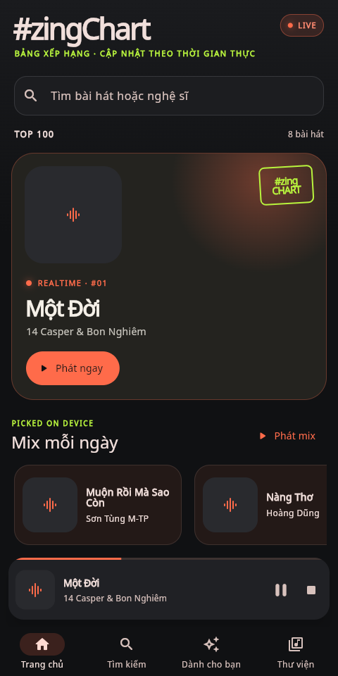<br><sub><b>Trang chủ</b> · ZingChart realtime và Daily Mix</sub></td>
    <td width="33%" align="center">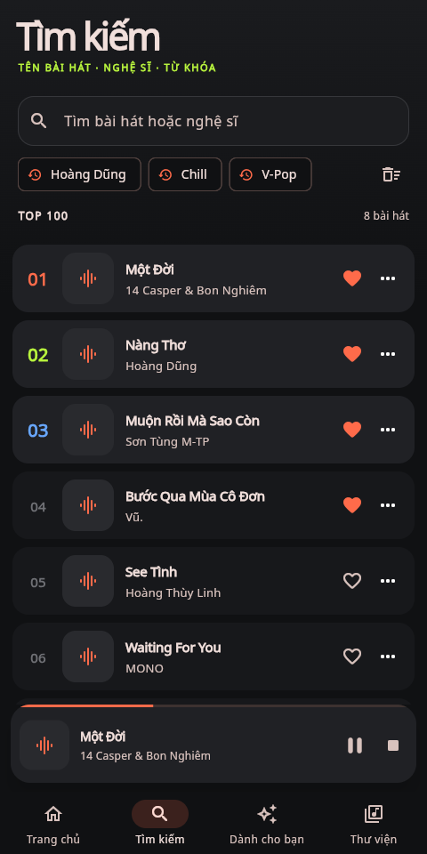<br><sub><b>Tìm kiếm</b> · tên bài, nghệ sĩ và từ khóa gần đây</sub></td>
    <td width="33%" align="center">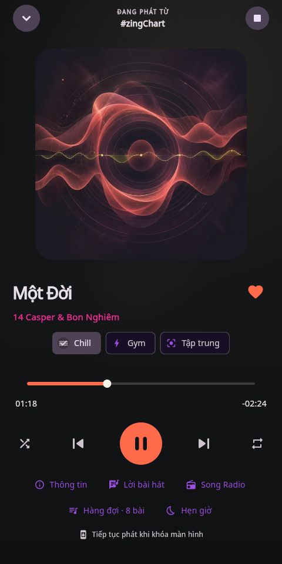<br><sub><b>Now Playing</b> · seek, queue, mood và sleep timer</sub></td>
  </tr>
  <tr>
    <td align="center">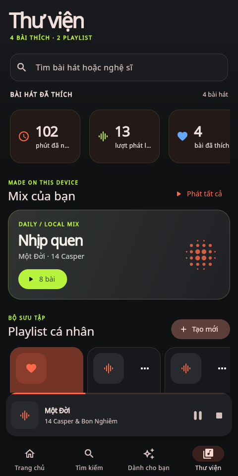<br><sub><b>Thư viện</b> · favorites, playlist và backup local</sub></td>
    <td colspan="2" align="center">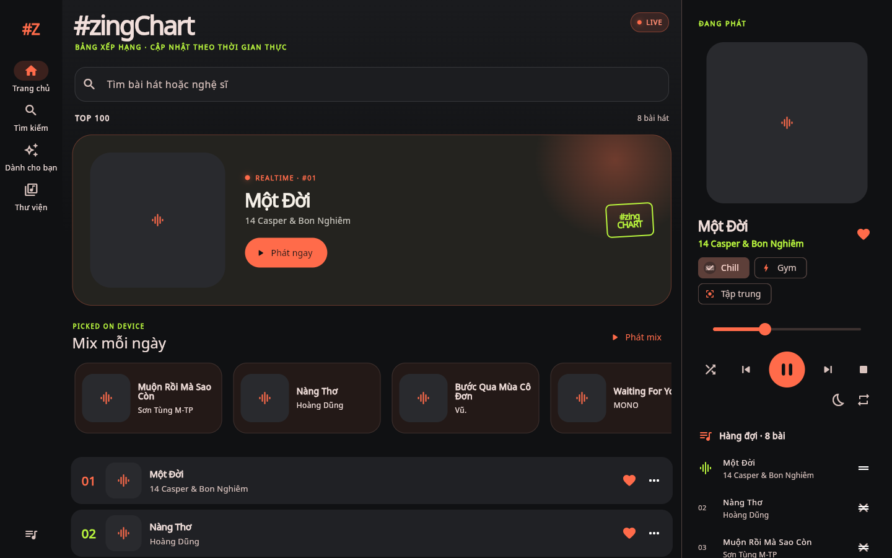<br><sub><b>Desktop adaptive</b> · chart, Now Playing và queue trong cùng workspace</sub></td>
  </tr>
</table>

### v1.1 — Local Intelligence

<table>
  <tr>
    <td width="33%" align="center">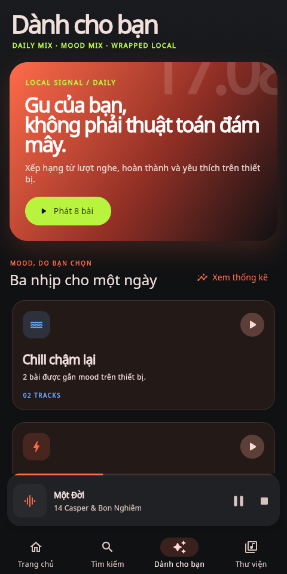<br><sub><b>Dành cho bạn</b> · Daily Mix và Mood Mix tại máy</sub></td>
    <td width="33%" align="center">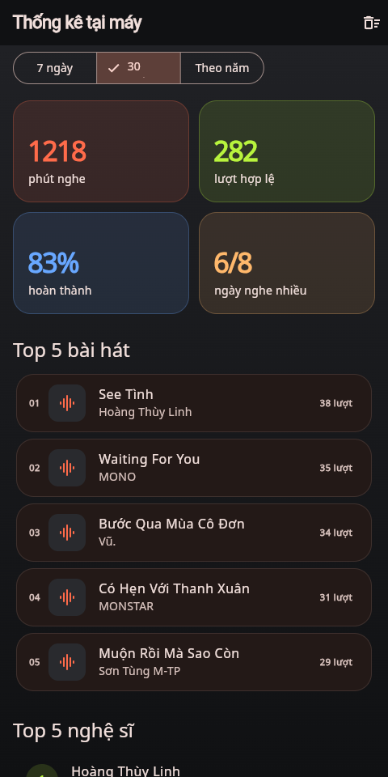<br><sub><b>Thống kê</b> · 7 ngày, 30 ngày và theo năm</sub></td>
    <td width="33%" align="center">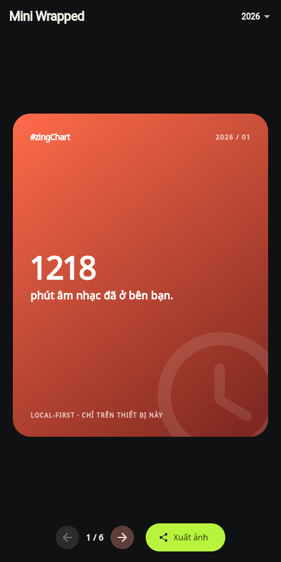<br><sub><b>Mini Wrapped</b> · sáu slide và xuất PNG</sub></td>
  </tr>
  <tr>
    <td colspan="3" align="center">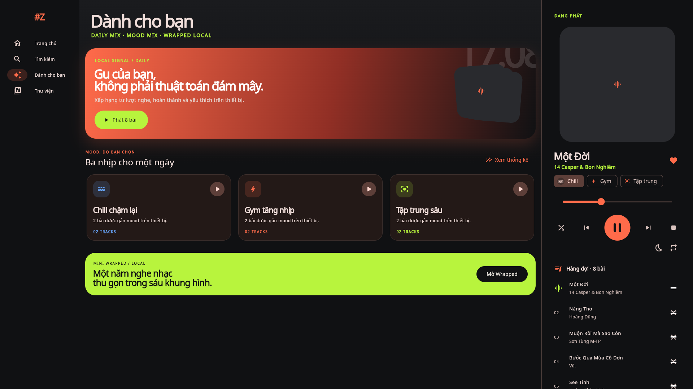<br><sub><b>TV 10-foot UI</b> · điều hướng remote, mix local và player panel</sub></td>
  </tr>
</table>

### v1.2 — Khám phá catalog Zing MP3

<table>
  <tr>
    <td colspan="2" align="center">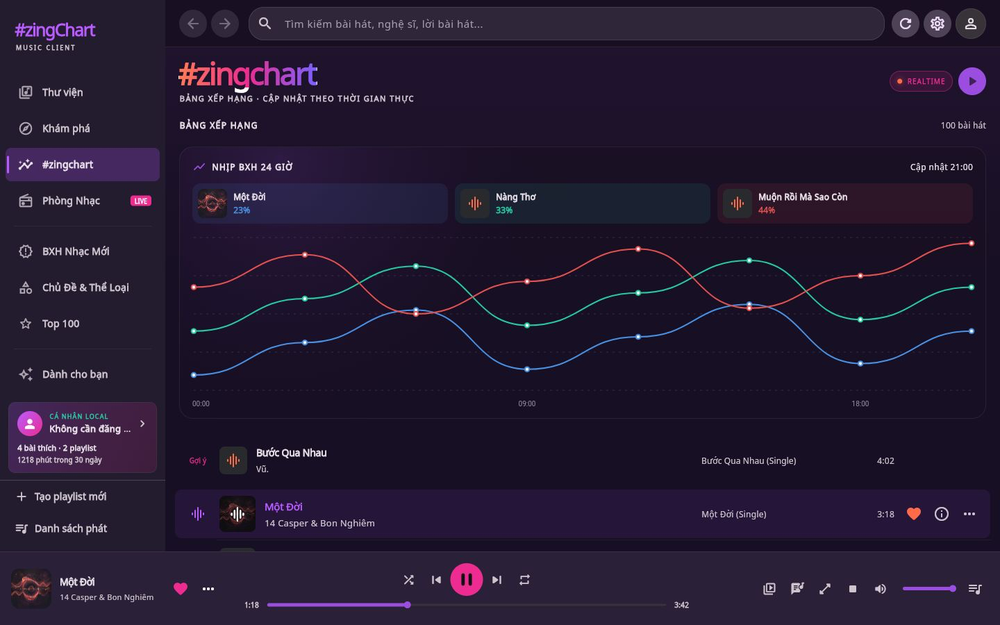<br><sub><b>Desktop catalog workspace</b> · biểu đồ 24 giờ, Gợi ý chính thức với nghệ sĩ/album mở nội bộ, metadata BXH và playback dock cùng màn hình</sub></td>
  </tr>
  <tr>
    <td colspan="2" align="center">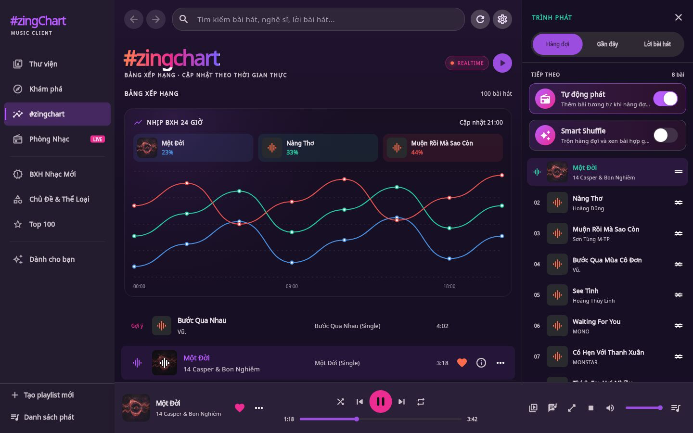<br><sub><b>Playback dock & queue drawer kiểu Zing MP3</b> · mở nhanh MV, lời/Karaoke, Now Playing và menu bài hát; queue đổi thứ tự được, lịch sử chỉ ở trên thiết bị</sub></td>
  </tr>
  <tr>
    <td colspan="2" align="center">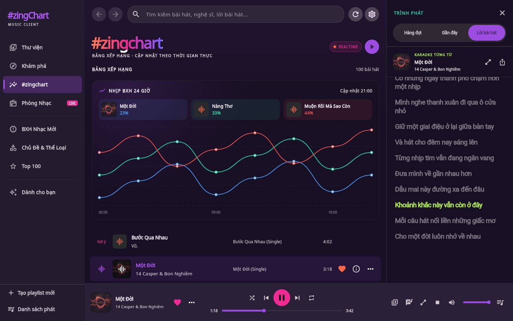<br><sub><b>Lời đồng bộ ngay trong catalog</b> · theo dõi câu đang hát, chạm để tua hoặc mở Karaoke toàn màn hình mà không rời trang đang duyệt</sub></td>
  </tr>
  <tr>
    <td colspan="2" align="center">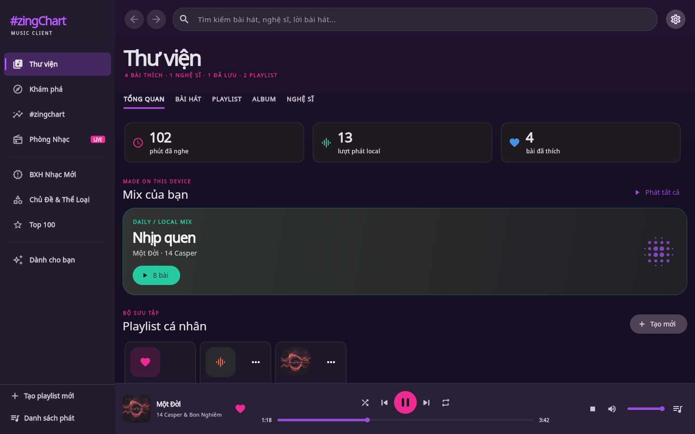<br><sub><b>Thư viện kiểu Zing, dữ liệu Local-First</b> · năm phân mục responsive, playlist cá nhân và nội dung chính thức đã lưu mà không cần tài khoản</sub></td>
  </tr>
  <tr>
    <td colspan="2" align="center">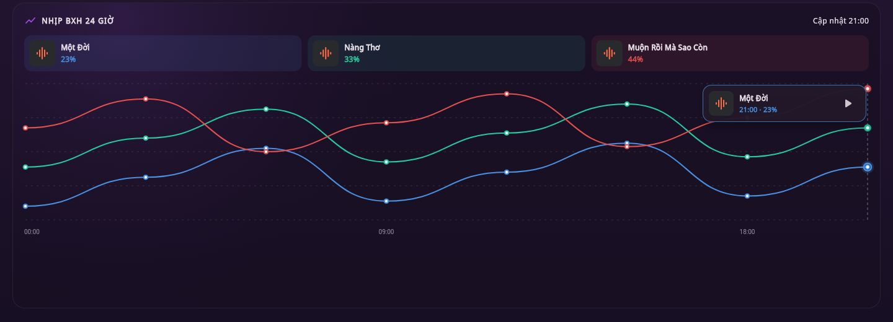<br><sub><b>Nhịp BXH 24 giờ</b> · hover, chạm/kéo hoặc remote để xem tỷ lệ theo giờ và phát bài đang chọn</sub></td>
  </tr>
  <tr>
    <td colspan="2" align="center">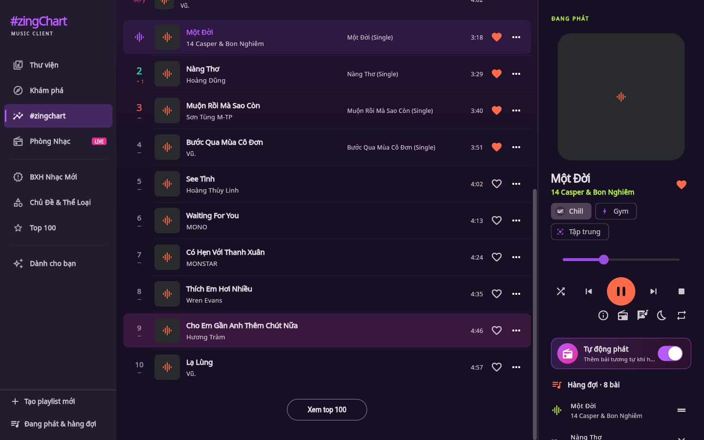<br><sub><b>Top 10 → Top 100</b> · mặc định gọn như Zing MP3, mở rộng tại chỗ nhưng queue luôn giữ đủ BXH</sub></td>
  </tr>
  <tr>
    <td width="50%" align="center">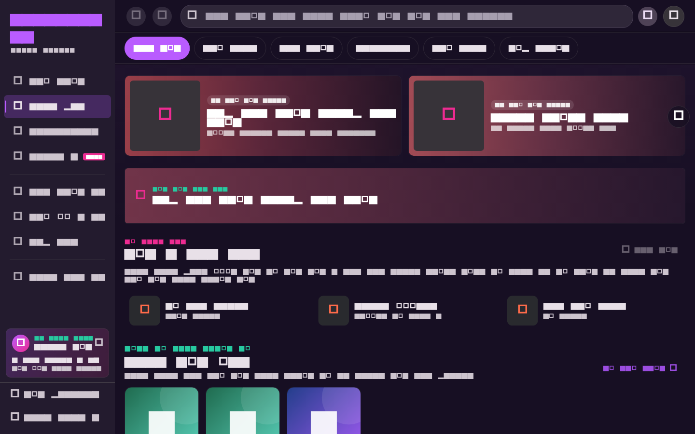<br><sub><b>Khám phá</b> · artwork trái kiểu Zing, banner panorama không phủ metadata và carousel điều khiển được</sub></td>
    <td width="50%" align="center">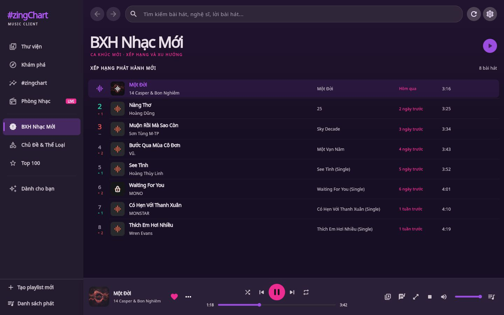<br><sub><b>BXH Nhạc Mới</b> · nghệ sĩ/album mở nội bộ, thứ hạng, xu hướng, thời lượng và hàng đợi chỉ gồm bài phát được</sub></td>
  </tr>
  <tr>
    <td colspan="2" align="center">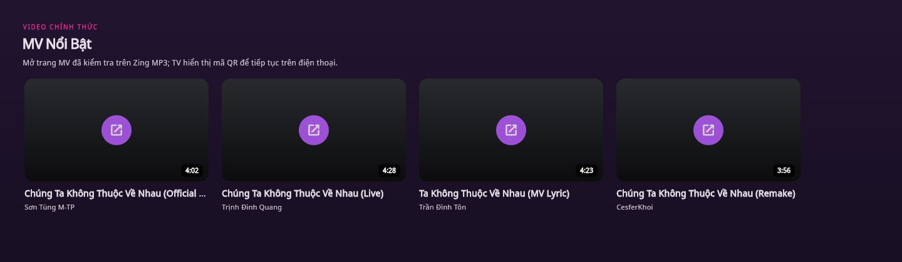<br><sub><b>MV Nổi Bật</b> · card 16:9 adaptive, chỉ mở trang Zing đã kiểm tra và dùng QR handoff trên TV</sub></td>
  </tr>
  <tr>
    <td colspan="2" align="center">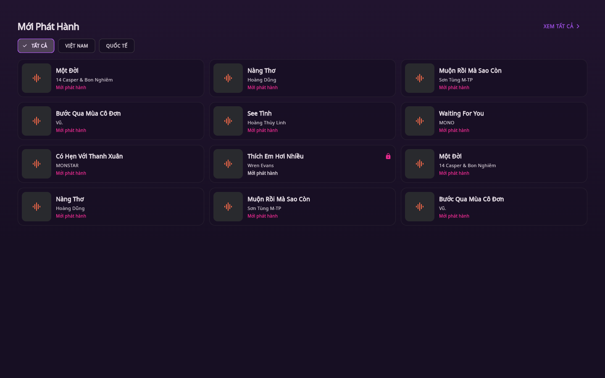<br><sub><b>Mới Phát Hành trên Home</b> · 12 bài, lọc Tất cả/Việt Nam/Quốc tế và queue loại bài khóa</sub></td>
  </tr>
  <tr>
    <td colspan="2" align="center">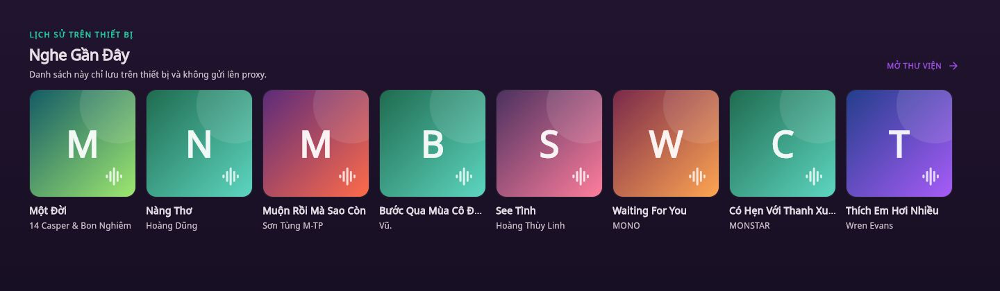<br><sub><b>Nghe Gần Đây</b> · lịch sử riêng tư trên thiết bị, queue đã khử trùng lặp và không gửi lên proxy</sub></td>
  </tr>
  <tr>
    <td colspan="2" align="center">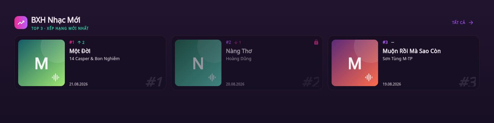<br><sub><b>Top 3 BXH Nhạc Mới</b> · spotlight responsive, trạng thái bài khóa và queue chỉ gồm bài phát được</sub></td>
  </tr>
  <tr>
    <td colspan="2" align="center">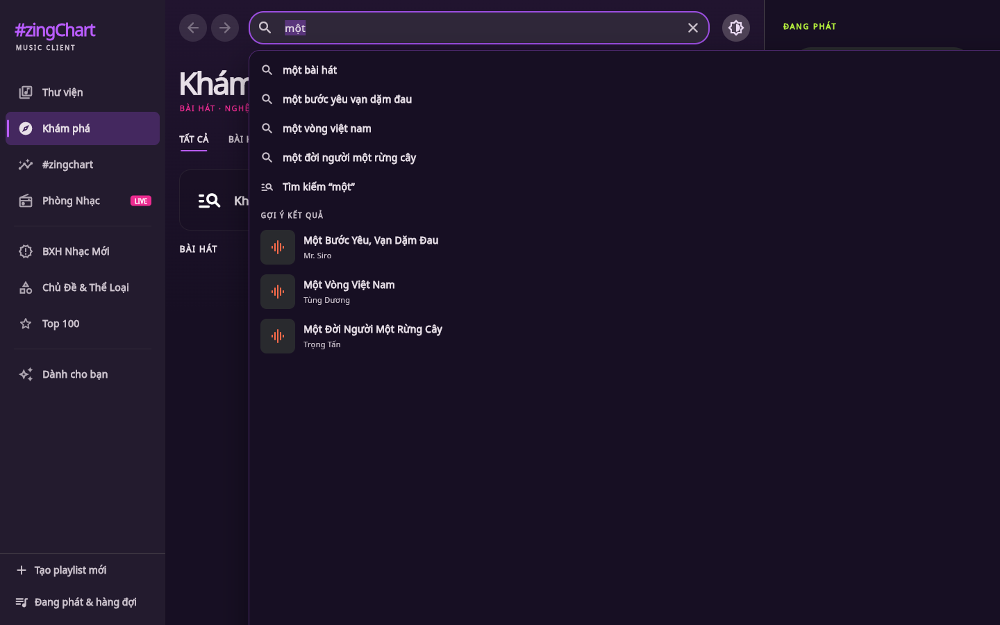<br><sub><b>Autocomplete tìm kiếm</b> · bài xem trước mở Song Detail trước khi người dùng chủ động Play, hỗ trợ chuột, bàn phím và remote TV</sub></td>
  </tr>
  <tr>
    <td colspan="2" align="center">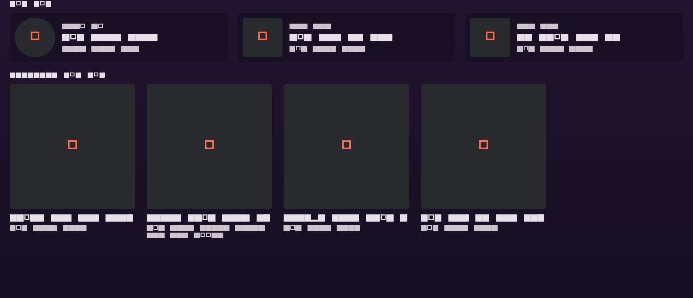<br><sub><b>Tất cả · Nổi bật</b> · một nghệ sĩ, hai bài hát, follower thật và bố cục responsive 1/2/3 cột</sub></td>
  </tr>
  <tr>
    <td colspan="2" align="center">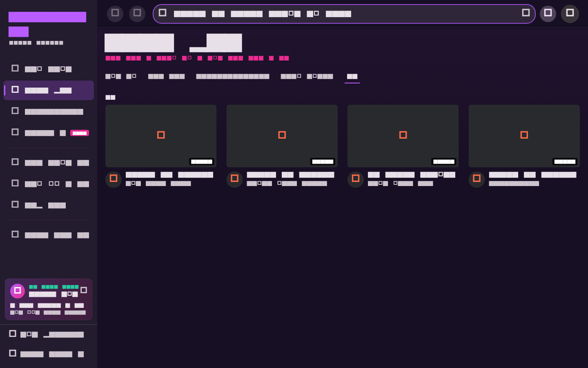<br><sub><b>Tìm kiếm MV chính thức</b> · thumbnail 16:9, thời lượng, avatar nghệ sĩ và overlay hover/focus; mở bằng liên kết Zing hoặc QR trên TV</sub></td>
  </tr>
  <tr>
    <td width="50%" align="center">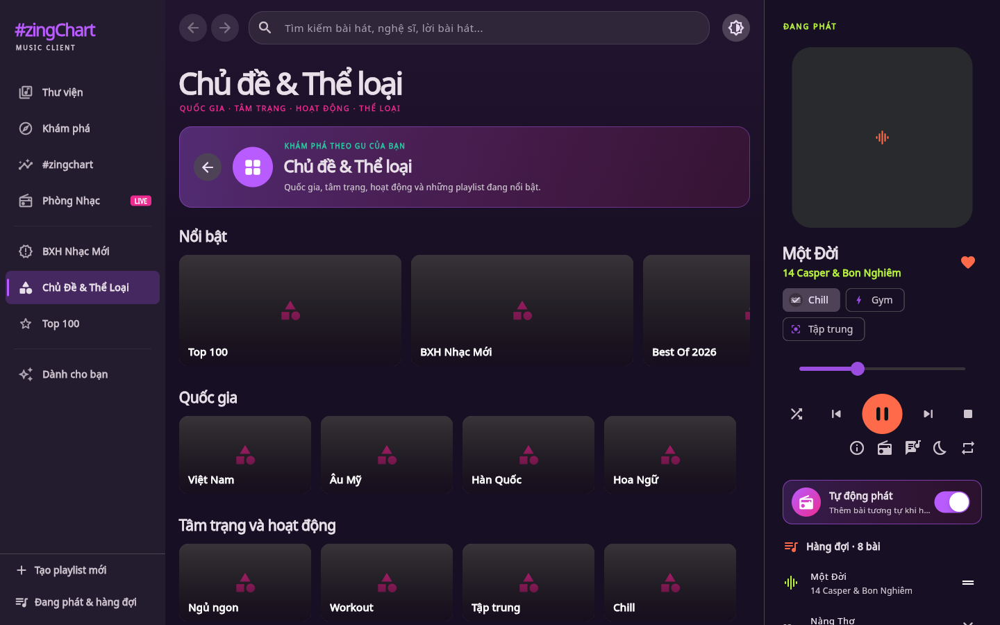<br><sub><b>Chủ đề & Thể loại</b> · điều hướng responsive từ hub đến playlist/album detail</sub></td>
    <td width="50%" align="center">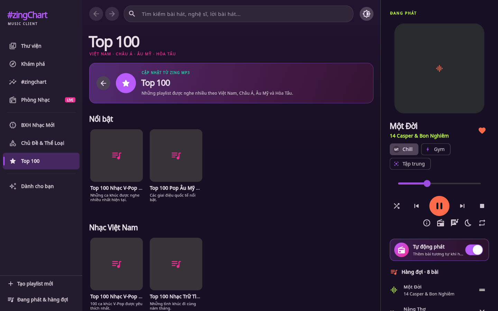<br><sub><b>Top 100</b> · playlist theo Nổi bật, Việt Nam, Châu Á, Âu Mỹ và Hòa Tấu</sub></td>
  </tr>
  <tr>
    <td colspan="2" align="center">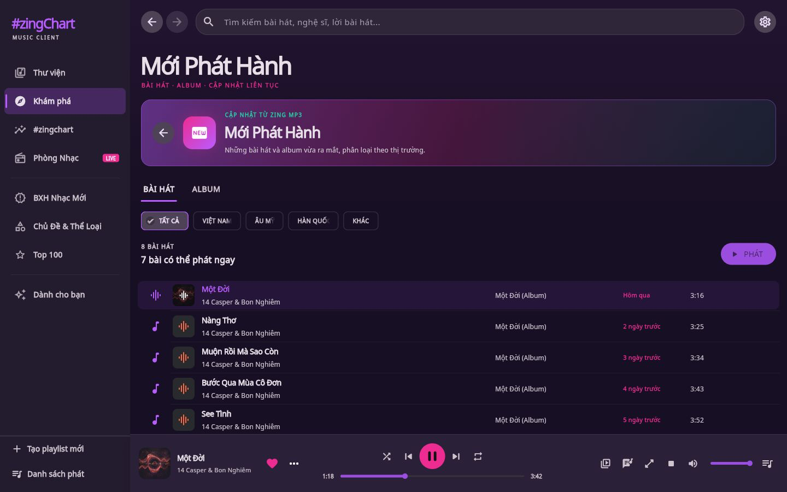<br><sub><b>Mới Phát Hành</b> · từng bài hiện nghệ sĩ/album điều hướng nội bộ và thời lượng; kèm tab Album, lọc thị trường, thời điểm ra mắt và playback fail-closed</sub></td>
  </tr>
  <tr>
    <td colspan="2" align="center">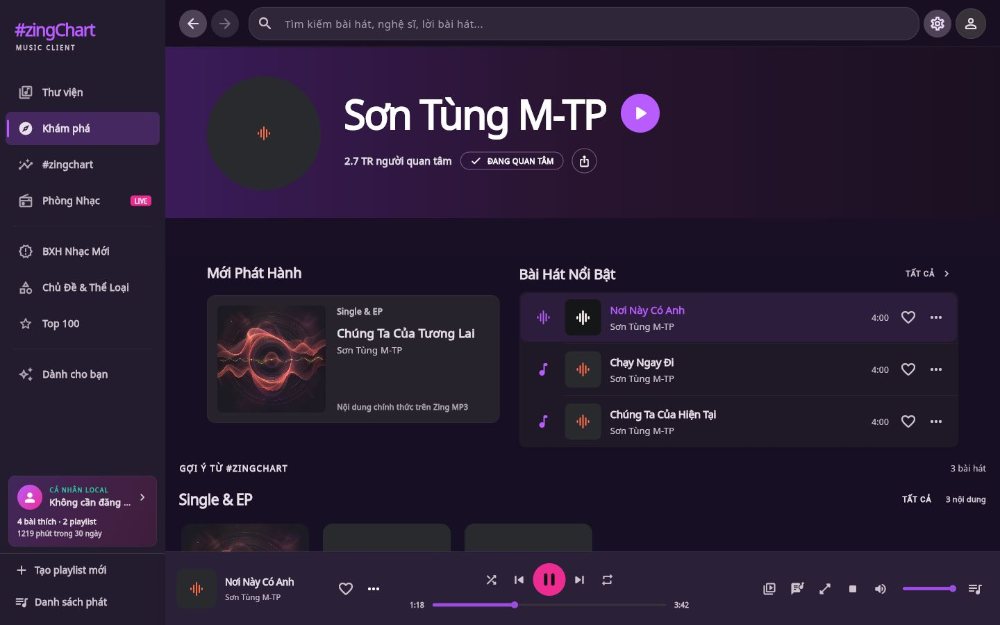<br><sub><b>Nghệ sĩ/OA</b> · hero full-width cùng Mới Phát Hành/Bài Hát Nổi Bật hai cột; TẤT CẢ mở tối đa 50 bài, Single & EP hoặc MV ngay trong app</sub></td>
  </tr>
  <tr>
    <td colspan="2" align="center">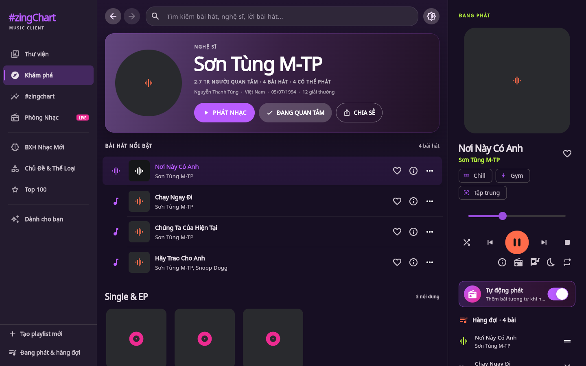<br><sub><b>Quan tâm nghệ sĩ</b> · theo dõi OA không cần tài khoản, khôi phục qua backup v3 và mở lại từ Thư viện</sub></td>
  </tr>
  <tr>
    <td colspan="2" align="center">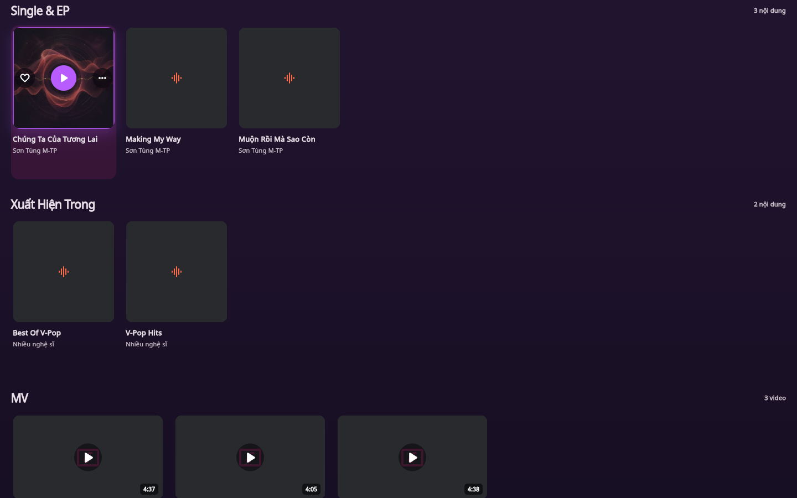<br><sub><b>Catalog nghệ sĩ</b> · Collection có Play/Lưu/Thêm/Chia sẻ; MV có nút phát riêng; các rail hỗ trợ chuột, swipe, bàn phím và remote TV</sub></td>
  </tr>
  <tr>
    <td width="34%" align="center">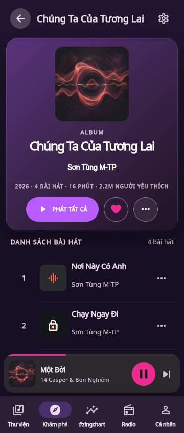<br><sub><b>Collection mobile</b> · Play/Lưu/Thêm cỡ chạm, Share trong menu và hàng bài chỉ giữ một overflow</sub></td>
    <td width="66%" align="center">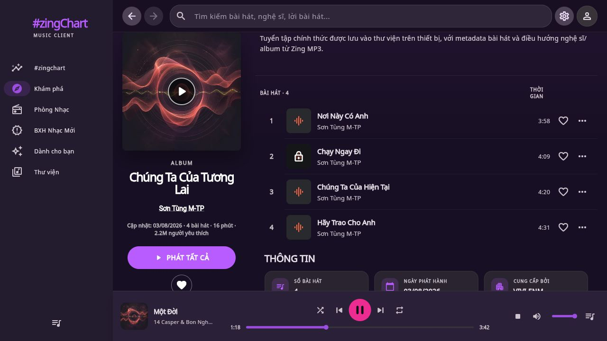<br><sub><b>Album/playlist desktop</b> · CTA theo loại nội dung, track đánh số hoặc cột Album, bài khóa fail-closed và trạng thái lưu vẫn local-first</sub></td>
  </tr>
  <tr>
    <td colspan="2" align="center">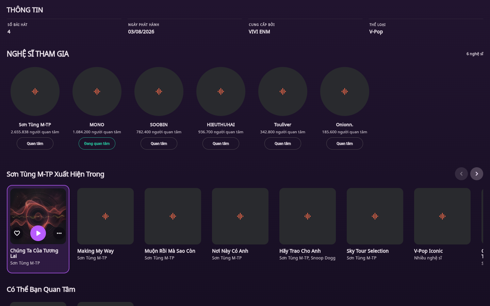<br><sub><b>Thông tin bộ sưu tập</b> · metadata gọn, nghệ sĩ tham gia có theo dõi local và các rail liên quan với Play/Lưu/Chia sẻ</sub></td>
  </tr>
  <tr>
    <td colspan="2" align="center">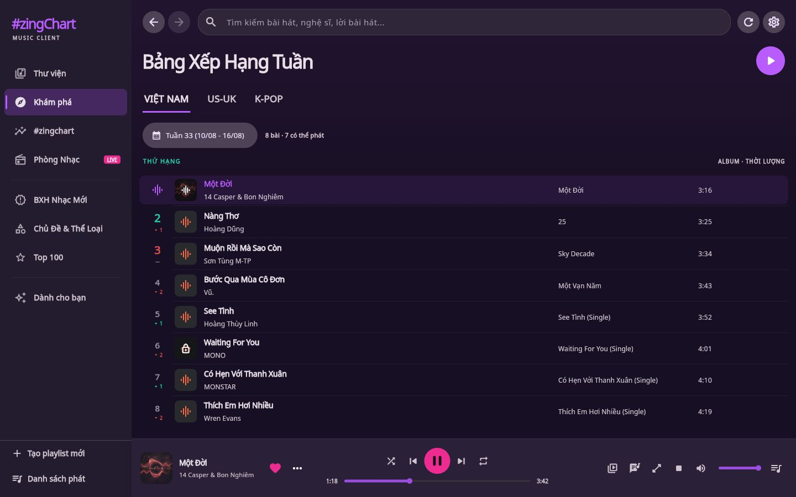<br><sub><b>BXH Tuần</b> · Việt Nam/US-UK/K-Pop, nghệ sĩ/album mở nội bộ, biến động hạng, thời lượng và queue chỉ gồm bài phát được</sub></td>
  </tr>
  <tr>
    <td colspan="2" align="center">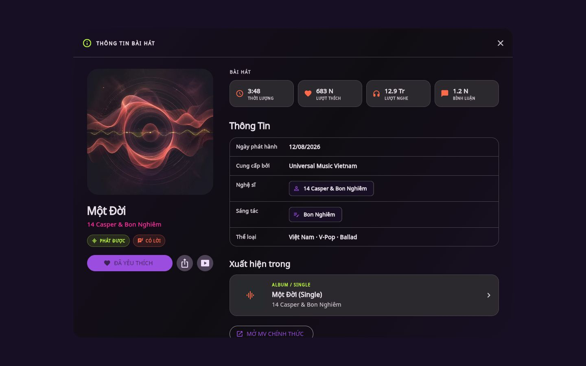<br><sub><b>Thông Tin bài hát</b> · metadata, số liệu tương tác, nghệ sĩ/album điều hướng nội bộ, chia sẻ liên kết và MV chính thức</sub></td>
  </tr>
  <tr>
    <td colspan="2" align="center">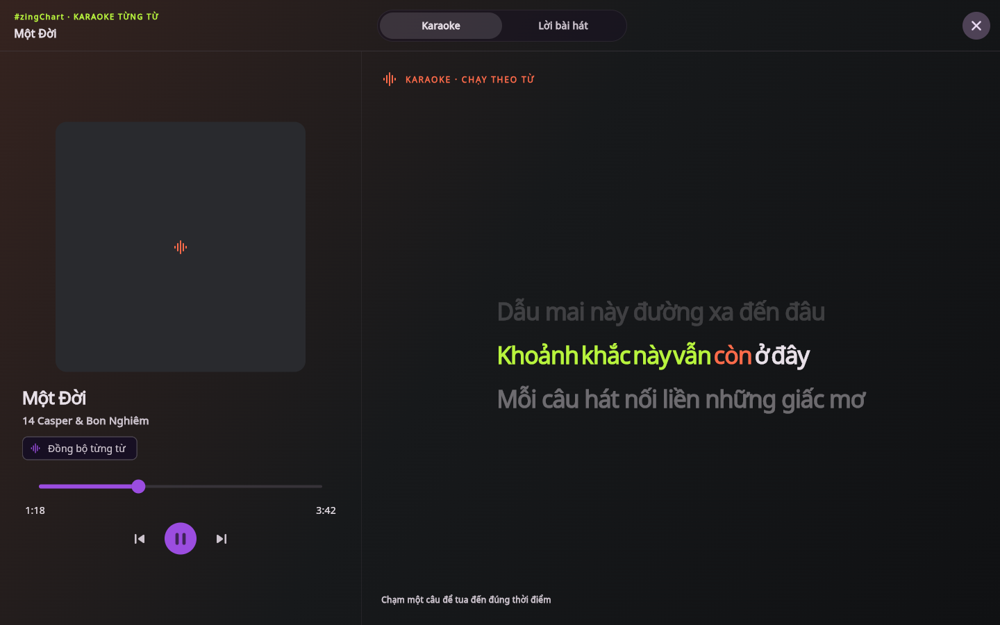<br><sub><b>Karaoke & lời bài hát</b> · ảnh bìa lớn, đồng bộ từng từ, chạm để tua và thích ứng mobile/desktop/TV</sub></td>
  </tr>
  <tr>
    <td colspan="2" align="center">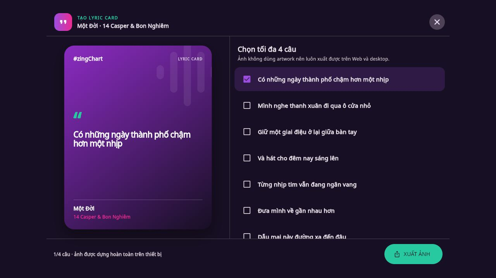<br><sub><b>Lyric Card</b> · chọn tối đa bốn câu, render PNG tại máy và dùng QR local trên TV</sub></td>
  </tr>
  <tr>
    <td colspan="2" align="center">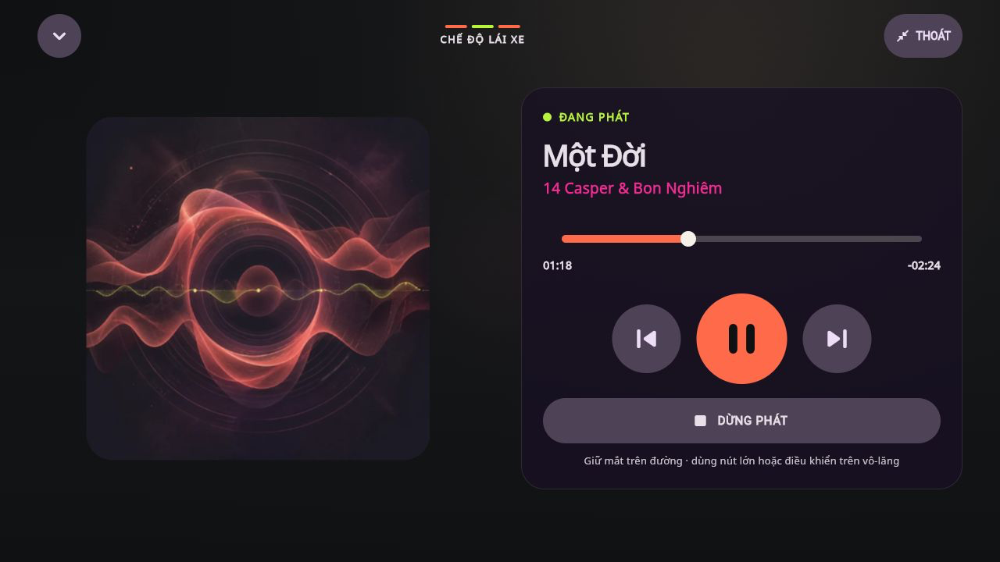<br><sub><b>Chế độ lái xe</b> · thông tin dễ liếc, tiến trình rõ và điều khiển Previous/Play/Next/Stop cỡ lớn</sub></td>
  </tr>
  <tr>
    <td colspan="2" align="center">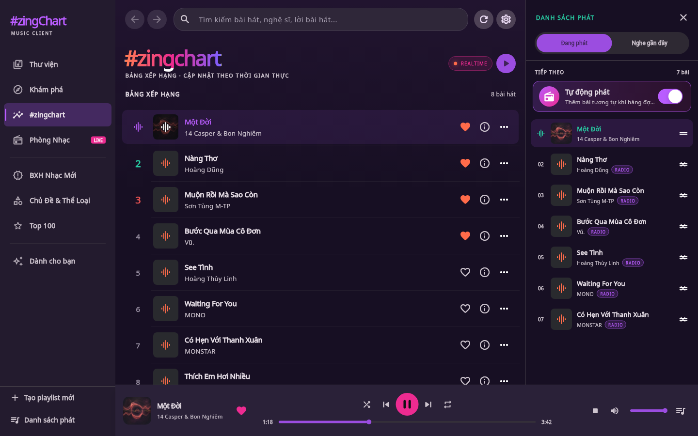<br><sub><b>Song Radio</b> · gợi ý được phép, tự nối hàng đợi và điều khiển autoplay trên mobile/desktop/TV</sub></td>
  </tr>
  <tr>
    <td colspan="2" align="center">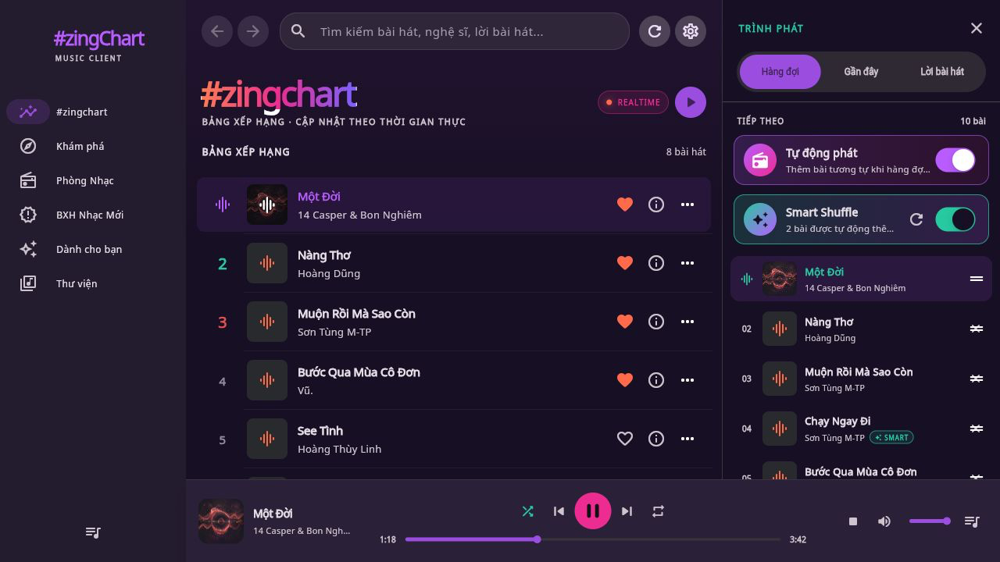<br><sub><b>Smart Shuffle</b> · xen gợi ý local-first, giữ thứ tự bài gốc và gắn nhãn rõ cho từng bài tự thêm</sub></td>
  </tr>
  <tr>
    <td colspan="2" align="center">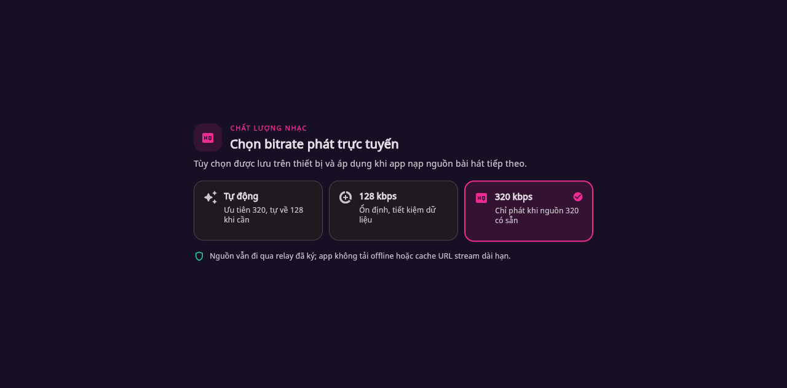<br><sub><b>Chất lượng phát thật</b> · Auto ưu tiên 320 rồi về 128; chế độ 128/320 giữ đúng bitrate đã chọn qua relay ký số</sub></td>
  </tr>
  <tr>
    <td colspan="2" align="center">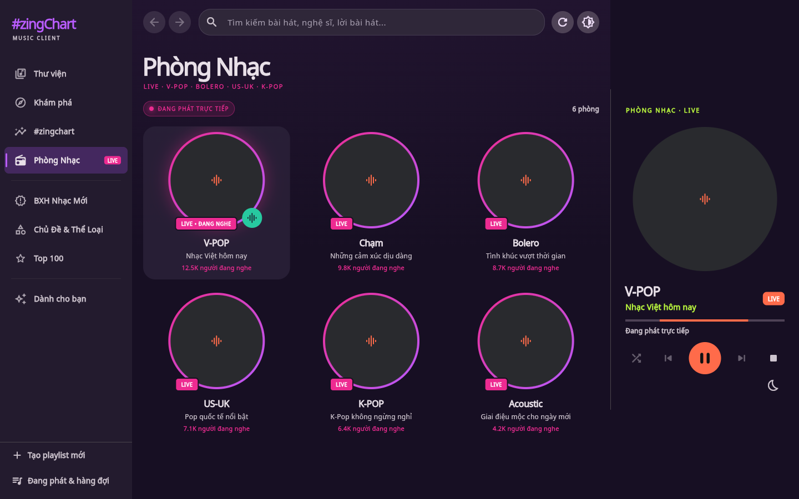<br><sub><b>Phòng Nhạc LIVE</b> · kênh trực tiếp, chương trình hiện tại, lượng người nghe và HLS same-origin trên mobile/desktop/TV</sub></td>
  </tr>
</table>

Fixture dùng để tái tạo gallery nằm tại
[`tool/docs_screenshot_app.dart`](tool/docs_screenshot_app.dart). Entry point này
không gọi proxy, audio thật hoặc media service của hệ điều hành.
Icon đa nền tảng được sinh từ
[`assets/brand/zingchart-mark.svg`](assets/brand/zingchart-mark.svg); chạy
`node tool/generate_brand_assets.mjs --check` để phát hiện asset cũ hoặc thiếu.

### Widget và đồng hồ

| Bề mặt | Trạng thái | Điều khiển |
| --- | --- | --- |
| Android Home Widget | Có | Previous, play/pause, next |
| Fire OS tablet | Có trong APK Android; phụ thuộc launcher của thiết bị có cho đặt widget hay không | Previous, play/pause, next |
| iOS/iPadOS WidgetKit | iOS/iPadOS 17+ | Previous, play/pause, next qua `AudioPlaybackIntent` |
| macOS WidgetKit | macOS 14+ | Previous, play/pause, next |
| HarmonyOS Service Widget | API 18 | Previous, play/pause, next; mở EntryAbility khi cần đánh thức Flutter |
| Wear OS remote | Wear OS 3+, ghép với Android phone | Previous, play/pause, next qua Data Layer |
| watchOS remote | watchOS 10+, ghép với iPhone | Previous, play/pause, next qua WatchConnectivity |
| Windows/Linux/Web/TV | Không có home-widget portable trong v1 | Dùng SMTC, MPRIS, Media Session hoặc remote TV sẵn có |

Widget/watch chỉ nhận snapshot metadata, trạng thái và lệnh điều khiển. Lịch sử,
analytics, favorites và URL stream không được gửi ra server hay sang wearable.

## 2. Kiến trúc và thư mục

```text
Flutter clients
    │
    ├── GET /v1/chart
    ├── GET /v1/charts/new-releases
    ├── GET /v1/charts/weekly?region={region}&week={week}&year={year}
    ├── GET /v1/discovery/categories
    ├── GET /v1/discovery/recommendations
    ├── GET /v1/discovery/home?categoryId={id}
    ├── GET /v1/search/suggestions?q={query}
    ├── GET /v1/hubs
    ├── GET /v1/hubs/{id}
    ├── GET /v1/top-100
    ├── GET /v1/releases
    ├── GET /v1/artists/{alias}
    ├── GET /v1/search?q={query}
    ├── GET /v1/collections/{id}
    ├── GET /v1/songs/{code}/lyrics
    ├── GET /v1/songs/{code}/radio
    ├── GET /v1/radio
    ├── GET /v1/radio/{id}/source
    ├── GET /v1/live-streams/{opaqueToken}
    ├── GET /v1/songs/{code}/source
    └── GET /v1/streams/{signedToken}
              │
              ▼
        Node/Fastify proxy
              │
              ▼
          Zing upstream
```

| Thành phần | Vị trí | Vai trò |
| --- | --- | --- |
| Flutter app | `lib/` | UI, playback, Local-First library |
| Proxy | `proxy/` | Chuẩn hóa chart, ký URL và relay audio |
| Native runners | `android/`, `ios/`, `web/`, `windows/`, `macos/`, `linux/` | Runner từng hệ điều hành |
| Companion surfaces | `android/wear/`, `ios/ZingChartWatch/`, `ios/ZingChartWidget/`, `macos/ZingChartWidget/` | Widget và smartwatch remote |
| Packaging | `packaging/` | Fire OS, TV, HarmonyOS, Apple target preparation và installer desktop |
| CI/Release | `.github/workflows/` | Test và build artifact đa nền tảng |

`GET /v1/chart` trả cả danh sách 100 bài và trend 24 giờ của top 3. Flutter sử
dụng trực tiếp các điểm realtime này cho biểu đồ `#zingchart`; không mô phỏng
counter ở phía client và không gửi dữ liệu nghe local lên proxy. UI dựng top 10
trước, chỉ dựng đủ top 100 khi người dùng yêu cầu, nhưng queue phát luôn đầy đủ.

`GET /v1/charts/new-releases` dùng current-API adapter được cấp quyền, cache
ngắn hạn và chỉ đánh dấu `playable` khi upstream trả `streamingStatus = 1`.
Endpoint này cần cặp `ZING_CURRENT_API_KEY`/`ZING_CURRENT_API_SIGNING_KEY`; các
credential chỉ tồn tại trên proxy.

`GET /v1/charts/weekly` chuẩn hóa Bảng Xếp Hạng Tuần chính thức cho `vietnam`,
`usuk` hoặc `korea`. `week` và `year` phải xuất hiện cùng nhau; nếu bỏ cả hai,
upstream trả tuần mới nhất. Proxy ký request ở server, cache single-flight theo
khu vực/kỳ và chỉ bật playback khi `streamingStatus = 1`.

`GET /v1/songs/{code}/lyrics` ký request lời bài hát ở proxy, chuẩn hóa karaoke
thành các dòng có `startTimeMs`/`endTimeMs` và trả fallback lời tĩnh khi không
có timestamp. Flutter không gọi URL file lời bên ngoài; cache và single-flight
được khóa theo mã bài hát, còn credential luôn ở server.

`GET /v1/songs/{code}/radio` ký request recommendation ở proxy và chỉ giữ bài
có `streamingStatus = 1`, không private/pre-release, không trùng seed hoặc trùng
ID. Kết quả tối đa 30 bài được cache single-flight ngắn hạn; favorites, analytics
và lịch sử nghe local tuyệt đối không được gửi lên endpoint này.

`GET /v1/radio` trả danh sách Phòng Nhạc LIVE đã chuẩn hóa. Endpoint source chỉ
trả token first-party được mã hóa; master/media playlist, key và segment HLS
được proxy kiểm tra allowlist, rewrite thành `/v1/live-streams/{opaqueToken}` và
relay với timeout/body cap. Client không nhận URL CDN, credential hoặc payload
radio thô; phiên LIVE cũng không được ghi vào analytics, lịch sử hay backup.

`GET /v1/discovery/categories` chuẩn hóa rail danh mục Home; client tự thêm
“Cho bạn” với ID `-1`. `GET /v1/discovery/home?categoryId={id}` trả Quick Play,
banner editorial và collection rail đúng danh mục đã chọn; `adBanner` quảng cáo
bị loại bỏ. Flutter chỉ gọi proxy; khi mở một card, app dùng tiếp endpoint
collection detail hiện có. Category list và từng Home
được single-flight cache theo `SEARCH_CACHE_TTL_MS`; không endpoint nào nhận
analytics hoặc lịch sử nghe local.

Rail “Nghe Gần Đây” là dữ liệu Local-First do Flutter dựng trực tiếp từ lịch sử
trên thiết bị; proxy không có endpoint, tham số hoặc payload nào cho rail này.
Xóa lịch sử trong app cũng xóa nội dung rail nhưng không ảnh hưởng favorites.
Menu hành động trên rail dùng lại đúng contract của các hàng bài hát khác và
không gửi lịch sử local qua mạng.

`GET /v1/discovery/recommendations` ký request Song Station trên proxy, chỉ giữ
tối đa 12 bài công khai có `streamingStatus = 1` và trả metadata đã chuẩn hóa.
Client luân phiên sáu bài mỗi lần bấm “Làm mới”; nếu endpoint lỗi, UI dùng chart
hiện tại làm fallback fail-closed. Request này không chứa installation ID,
favorites hay lịch sử.

`GET /v1/hubs` chuẩn hóa trang Chủ đề & Thể loại thành bốn nhóm Nổi bật, Quốc
gia, Tâm trạng/Hoạt động và Thể loại. `GET /v1/hubs/{id}` trả metadata cùng các
playlist rail của một hub; `GET /v1/top-100` trả các nhóm Top 100 theo đúng thứ
tự upstream. Ba endpoint dùng current-API adapter được cấp quyền, validation
fail-closed, cache single-flight và không nhận bất kỳ dữ liệu Local-First nào.

`GET /v1/releases` gom hai catalog Bài hát/Album Mới Phát Hành, chuẩn hóa khu
vực Việt Nam, Âu Mỹ, Hàn Quốc và Khác, đồng thời chỉ đánh dấu bài phát được khi
`streamingStatus` đúng bằng `1`. Endpoint cache single-flight ngắn hạn và không
nhận lịch sử nghe hay dữ liệu cá nhân từ client. Discovery Home tái sử dụng
snapshot này để dựng cụm 12 bài theo bố cục ba cột của Zing; lọc “Quốc tế” chỉ
gộp các vùng ngoài Việt Nam và queue luôn loại bài bị khóa.

`GET /v1/artists/{alias}` trả hồ sơ Nghệ sĩ/OA chính thức gồm metadata, người
quan tâm, 6 bài nổi bật và tối đa 50 bài từ catalog nghệ sĩ đã ký, tối đa 50 MV
công khai cho trang “Tất cả”, Single/EP, album, tuyển tập, nghệ sĩ liên quan và
tiểu sử plain text. App nhận trực tiếp các URL nghệ sĩ chính thức
`/{alias}/bai-hat`, `/{alias}/single` và `/{alias}/video`; trang tổng quan có
nút “TẤT CẢ” cho từng nhóm. Nếu catalog đầy đủ lỗi, proxy giữ cụm bài nổi bật
làm fallback. Proxy giới hạn kích thước từng nhóm, bỏ mục lỗi,
chỉ bật bài có `streamingStatus = 1` và cache single-flight theo alias; client
không gọi trực tiếp API Zing hoặc nhận credential ký request.

`GET /v1/search/suggestions` trả tối đa bốn từ khóa và sáu bài xem trước từ
adapter được ký tại proxy, hoặc fallback từ tìm kiếm legacy khi chưa cấu hình
credential. Endpoint không suy đoán quyền phát; chọn gợi ý luôn chạy lại
`GET /v1/search` với kiểm tra quyền fail-closed. Khi có credential current API,
proxy ký tìm kiếm chính thức rồi chuẩn hóa bài hát (kèm cờ có lời), nghệ sĩ/OA,
playlist/album và MV; bài chỉ phát khi `streamingStatus = 1`. MV không được relay
hay tải về: app chỉ mở trang `zingmp3.vn/video-clip/` đã kiểm tra, còn TV hoặc
nền tảng thiếu adapter sẽ hiện QR/copy. Khi chưa có credential, fallback legacy
không suy đoán quyền phát và không trả MV. `GET /v1/collections/{id}`
đọc metadata công khai cùng track list đã chuẩn
hóa; bài trùng với chart dùng luôn mã legacy đang phát được. Các bài ngoài chart
chỉ được bật Play khi proxy có current-API adapter được cấp quyền. Credential
của adapter chỉ nằm trong biến môi trường proxy, tuyệt đối không đóng gói vào
Flutter.

## 3. Yêu cầu chung

### Bắt buộc

- Git.
- FVM và Flutter `3.44.7`.
- Dart đi kèm Flutter; project yêu cầu Dart `>=3.12.0 <4.0.0`.
- Node.js `22+` cho proxy. Docker có thể thay thế Node khi chỉ chạy proxy.
- Một proxy URL; release build bắt buộc dùng HTTPS.

### Toolchain theo nền tảng

| Nền tảng | Toolchain bổ sung |
| --- | --- |
| Android/Android TV/Fire OS/Wear OS | Android SDK 36, Android Studio hoặc command-line tools, JDK 17; Wear OS emulator/device cho E2E |
| iOS/macOS/watchOS | macOS, full Xcode, CocoaPods; Ruby gem `xcodeproj 1.27.0`; WidgetKit yêu cầu iOS 17+/macOS 14+, watchOS 10+ |
| Windows | Windows, Visual Studio 2022 với Desktop development with C++, Windows 10/11 SDK |
| Linux | Clang, CMake, Ninja, GTK 3, LZMA và GStreamer development packages |
| webOS TV | Node.js và `@webos-tools/cli@3.2.5` |
| Tizen TV | Tizen Studio, TV Extension, Web CLI và Samsung certificate profile |
| HarmonyOS | CPF-Flutter OHOS, DevEco Studio CLI và HarmonyOS SDK 5.1.0 API 18 |

## 4. Cài đặt project lần đầu

### Bước 1: Clone và chọn đúng Flutter

```sh
git clone https://github.com/LamPPKK/Zing-Chart.git
cd Zing-Chart
fvm install 3.44.7
fvm use 3.44.7
fvm flutter doctor -v
```

### Bước 2: Cài dependency Flutter

```sh
fvm flutter pub get
```

Chỉ chạy code generation khi thay đổi DTO/Retrofit hoặc file có annotation:

```sh
fvm dart run build_runner build --delete-conflicting-outputs
```

### Bước 3: Chạy proxy local

```sh
cd proxy
cp .env.example .env
set -a
. ./.env
set +a
npm ci
npm run dev
```

Node không tự đọc file `.env`; ba lệnh `set -a`, `. ./.env`, `set +a` nạp và
export cấu hình vào process hiện tại. Khi đổi file `.env`, hãy khởi động lại
proxy.

Kiểm tra proxy trong terminal khác:

```sh
curl http://localhost:8080/health
curl http://localhost:8080/v1/chart
curl http://localhost:8080/v1/charts/new-releases
curl 'http://localhost:8080/v1/charts/weekly?region=vietnam'
curl 'http://localhost:8080/v1/charts/weekly?region=usuk&week=33&year=2026'
curl http://localhost:8080/v1/discovery/categories
curl http://localhost:8080/v1/discovery/recommendations
curl 'http://localhost:8080/v1/discovery/home?categoryId=-1'
curl 'http://localhost:8080/v1/discovery/home?categoryId=14'
curl http://localhost:8080/v1/hubs
curl http://localhost:8080/v1/hubs/IWZ9Z09B
curl http://localhost:8080/v1/top-100
curl http://localhost:8080/v1/releases
curl http://localhost:8080/v1/artists/Son-Tung-M-TP
curl --get http://localhost:8080/v1/search/suggestions --data-urlencode 'q=Sơn Tùng M-TP'
curl --get http://localhost:8080/v1/search --data-urlencode 'q=Sơn Tùng M-TP'
curl http://localhost:8080/v1/collections/6DIZIU79
curl http://localhost:8080/v1/songs/ZW79ZBE8/detail
curl http://localhost:8080/v1/songs/Z9WE0E96/lyrics
curl http://localhost:8080/v1/songs/Z9WE0E96/radio
curl http://localhost:8080/v1/radio
curl http://localhost:8080/v1/radio/IWZ979UB/source
```

Kết quả health hợp lệ:

```json
{"status":"ok"}
```

### Bước 4: Chạy Flutter app

```sh
cd ..
fvm flutter devices
fvm flutter run -d <desktop-device-id> \
  --dart-define=API_BASE_URL=http://localhost:8080
```

Chọn thiết bị cụ thể bằng `-d`:

```sh
fvm flutter run -d chrome --web-port=3000 \
  --dart-define=API_BASE_URL=http://localhost:8080

fvm flutter run -d <device-id> \
  --dart-define=API_BASE_URL=https://your-dev-proxy.example.com
```

`localhost:8080` phù hợp cho desktop và Chrome chạy trên cùng máy; web dev dùng
port `3000` để khớp CORS mặc định. Android/iOS emulator hoặc thiết bị thật nên
dùng proxy HTTPS truy cập được từ thiết bị.

## 5. Cấu hình proxy

Các biến chính nằm trong `proxy/.env.example`:

| Biến | Ý nghĩa |
| --- | --- |
| `NODE_ENV` | `development` hoặc `production` |
| `HOST`, `PORT` | Địa chỉ listen của proxy |
| `CORS_ORIGINS` | Allowlist origin, phân cách bằng dấu phẩy |
| `PUBLIC_BASE_URL` | URL public của proxy; production bắt buộc HTTPS |
| `STREAM_TOKEN_SECRET` | Secret ký stream token, production tối thiểu 32 ký tự |
| `STREAM_TOKEN_TTL_SECONDS` | Thời gian sống stream token |
| `STREAM_HOSTS` | Allowlist CDN upstream |
| `UPSTREAM_TIMEOUT_MS` | Timeout upstream |
| `CHART_CACHE_TTL_MS` | TTL cache chart |
| `RATE_LIMIT_MAX`, `RATE_LIMIT_WINDOW_MS` | Giới hạn request |
| `TRUST_PROXY_HOPS` | Số reverse proxy tin cậy phía trước service |

### Chạy production bằng Node

```sh
cd proxy
npm ci
npm run typecheck
npm test
npm run build
cp .env.example .env.production
# Chỉ tạo file này lần đầu; sửa NODE_ENV=production, URL, CORS và secret.
set -a
. ./.env.production
set +a
npm start
```

### Chạy production bằng Docker

Tạo `proxy/.env.production` với `NODE_ENV=production`, HTTPS public URL, CORS
allowlist và secret riêng. Sau đó chạy từ project root:

```sh
docker build -t zingchart-proxy:local ./proxy
docker run --rm \
  --env-file proxy/.env.production \
  -p 8080:8080 \
  zingchart-proxy:local
```

Kiểm tra container:

```sh
curl https://your-proxy.example.com/health
```

Không dùng `https://api.example.invalid` cho bản phát hành. URL này chỉ khiến
app hiển thị màn hình lỗi cấu hình an toàn.

## 6. Kiểm thử trước khi build

Chạy từ project root:

```sh
fvm flutter pub get
fvm dart format --output=none --set-exit-if-changed lib test
fvm flutter analyze
fvm flutter test --reporter expanded
```

Kiểm tra proxy:

```sh
cd proxy
npm ci
npm run typecheck
npm test
npm run build
cd ..
```

Kiểm tra packaging scripts:

```sh
node --test \
  packaging/apple/*.test.mjs \
  packaging/fireos/*.test.mjs \
  packaging/harmonyos/*.test.mjs \
  packaging/tv/*.test.mjs \
  packaging/wearos/*.test.mjs
```

## 7. Build và cài đặt theo nền tảng

Các ví dụ dưới đây dùng:

```sh
API_BASE_URL=https://proxy.example.com
VERSION=1.0.0
```

Thay URL và version bằng giá trị thật trước khi build.

### 7.1 Android phone/tablet

Build APK và Android App Bundle:

```sh
fvm flutter build apk --release \
  --dart-define=API_BASE_URL="$API_BASE_URL"

fvm flutter build appbundle --release \
  --dart-define=API_BASE_URL="$API_BASE_URL"
```

Artifact:

- `build/app/outputs/flutter-apk/app-release.apk`
- `build/app/outputs/bundle/release/app-release.aab`

Cài APK bằng ADB:

```sh
adb install -r build/app/outputs/flutter-apk/app-release.apk
```

#### Android production signing

Đặt keystore tại `android/app/release.jks`, rồi tạo file
`android/key.properties`:

```properties
storeFile=release.jks
storePassword=YOUR_STORE_PASSWORD
keyAlias=YOUR_KEY_ALIAS
keyPassword=YOUR_KEY_PASSWORD
```

Không commit keystore, password hoặc `key.properties`. Nếu file này không tồn
tại, Gradle sẽ ký release APK bằng debug key; artifact đó chỉ dùng để test.

#### Android Home Widget và Wear OS remote

Home Widget được đóng ngay trong APK Android và dùng MediaSession của
`audio_service`; không khởi tạo player riêng. Sau khi cài app, nhấn giữ màn hình
chính → **Widgets** → **#zingChart**.

Build APK remote cho Wear OS sau khi Flutter đã tạo Android build config:

```sh
fvm flutter build apk --release \
  --dart-define=API_BASE_URL="$API_BASE_URL"
./android/gradlew -p android :wear:assembleRelease
```

Artifact:

```text
build/wear/outputs/apk/release/wear-release.apk
```

APK phone và watch phải có cùng application ID `software.baycho.zmp3chart` và
cùng signing certificate để Wear OS Data Layer cho phép giao tiếp. Cài mỗi APK
đúng thiết bị tương ứng; mở app điện thoại ít nhất một lần rồi mở **#zingChart
Remote** trên đồng hồ. Data Layer chỉ truyền state/lệnh qua kết nối cục bộ của
Android/Wear OS. Fire OS không cần Google Play Services để widget Android hoạt
động; Wear OS sync tự vô hiệu hóa khi Play Services không có.

### 7.2 Android TV

Android runner đã có Leanback launcher, TV banner và đánh dấu touchscreen là
không bắt buộc. AAB Android bình thường có thể phục vụ cả phone/tablet/TV.

Để tạo APK ép giao diện TV phục vụ sideload/test:

```sh
fvm flutter build apk --release \
  --dart-define=API_BASE_URL="$API_BASE_URL" \
  --dart-define=TV_MODE=true
```

Cài lên TV hoặc emulator:

```sh
adb connect <ANDROID_TV_IP>:5555
adb install -r build/app/outputs/flutter-apk/app-release.apk
```

### 7.3 iOS

Yêu cầu macOS, full Xcode, CocoaPods và deployment target iOS 13+.

Tạo/cập nhật target WidgetKit và watchOS theo version trong `pubspec.yaml`:

```sh
gem install xcodeproj -v 1.27.0 --no-document
ruby packaging/apple/prepare_ios_companions.rb
```

Build app không ký để kiểm tra CI:

```sh
fvm flutter build ios --release --no-codesign \
  --dart-define=API_BASE_URL="$API_BASE_URL"
```

Artifact app bundle:

```text
build/ios/iphoneos/Runner.app
```

Build IPA khi Xcode đã cấu hình Team, certificate và provisioning profile:

```sh
fvm flutter build ipa --release \
  --dart-define=API_BASE_URL="$API_BASE_URL"
```

IPA nằm trong `build/ios/ipa/`. Có thể mở `ios/Runner.xcworkspace` bằng Xcode,
chọn thiết bị thật, cấu hình Signing & Capabilities rồi dùng Product → Archive
để cài qua TestFlight hoặc phương thức phân phối phù hợp.

Widget tương tác yêu cầu iOS/iPadOS 17+. Trong Apple Developer, đăng ký thêm:

- App Group `group.software.baycho.zmp3chart.shared`;
- bundle ID `software.baycho.zmp3chart.widget`;
- bundle ID `software.baycho.zmp3chart.watchkitapp`;
- provisioning profile riêng cho Runner, Widget và Watch, nhưng cùng team và
  distribution certificate.

Sau khi cài, thêm **#zingChart Widget** từ Widget Gallery. Trên Apple Watch, cài
**#zingChart Remote** từ ứng dụng Watch của iPhone. WatchConnectivity chỉ làm
remote cho app iPhone; watch không tải audio và không gửi analytics lên mạng.

### 7.4 Web/PWA

```sh
fvm flutter build web --release \
  --dart-define=API_BASE_URL="$API_BASE_URL"
```

Artifact: `build/web/`.

Smoke test local:

```sh
python3 -m http.server 8081 --directory build/web
```

Mở `http://localhost:8081`. Khi triển khai production, static host phải:

- phục vụ HTTPS;
- fallback route về `index.html`;
- không cache lâu file audio hoặc signed stream URL;
- có origin nằm trong `CORS_ORIGINS` của proxy.

Đóng tab hoặc trình duyệt sẽ kết thúc playback Web; autoplay lần đầu cần thao
tác của người dùng.

### 7.5 Windows desktop

Chỉ build Windows trên máy Windows:

```powershell
$env:API_BASE_URL = "https://proxy.example.com"
fvm flutter config --enable-windows-desktop
fvm flutter pub get
fvm flutter build windows --release `
  --dart-define=API_BASE_URL="$env:API_BASE_URL"
```

Bundle chạy trực tiếp:

```text
build/windows/x64/runner/Release/
```

Chạy `zmp3chart.exe` trong thư mục này; không tách riêng EXE khỏi DLL/data.

#### Portable ZIP và Inno Setup EXE

Cài Inno Setup 6, sau đó:

```powershell
./packaging/windows/package_windows.ps1 -Version 1.0.0
```

Artifact:

- `dist/windows/zingchart-windows-portable.zip`
- `dist/windows/zingchart-windows-installer.exe`

#### MSIX

MSIX cần Windows 10/11 SDK và Microsoft.VCLibs.Desktop 14.0 SDK:

```powershell
./packaging/windows/package_msix.ps1 -Version 1.0.0
```

Mặc định script tạo `dist/windows/zingchart-windows-development.msix` chưa ký
và copy VCLibs dependency. CI release tạo thêm development certificate cùng
script cài đặt. Trên máy test dùng PowerShell chạy với quyền Administrator:

```powershell
PowerShell.exe -NoProfile -ExecutionPolicy Bypass `
  -File .\install-zingchart-development.ps1
```

Đối với Microsoft Store, `Publisher`, `IdentityName` và
`PublisherDisplayName` phải khớp chính xác Partner Center. Đây là Flutter Win32
được đóng gói MSIX, không phải UWP runner.

### 7.6 macOS

Yêu cầu full Xcode:

```sh
fvm flutter config --enable-macos-desktop
fvm flutter pub get
gem install xcodeproj -v 1.27.0 --no-document
ruby packaging/apple/prepare_macos_widget.rb
fvm flutter build macos --release \
  --dart-define=API_BASE_URL="$API_BASE_URL"
./packaging/macos/package_macos.sh
```

Artifact:

- `build/macos/Build/Products/Release/#zingChart.app`
- `dist/macos/zingchart-macos-app.zip`
- `dist/macos/zingchart-macos.dmg`

Mở DMG và kéo app vào Applications. Bản phát hành bên ngoài máy phát triển cần
Developer ID signing, hardened runtime, notarization và stapling.

WidgetKit yêu cầu macOS 14+ và App Group
`group.software.baycho.zmp3chart.shared`. Sau khi cài app, mở Notification
Center → **Edit Widgets** → thêm **#zingChart**. Windows và Linux tiếp tục dùng
SMTC/MPRIS vì không có một home-widget API chung tương đương trong codebase.

### 7.7 Linux x64

Trên Ubuntu 22.04:

```sh
sudo apt-get update
sudo apt-get install -y \
  clang cmake ninja-build pkg-config \
  libgtk-3-dev liblzma-dev libfuse2 \
  libgstreamer1.0-dev libgstreamer-plugins-base1.0-dev

fvm flutter config --enable-linux-desktop
fvm flutter pub get
fvm flutter build linux --release \
  --dart-define=API_BASE_URL="$API_BASE_URL"
```

Bundle chạy trực tiếp:

```text
build/linux/x64/release/bundle/
```

Tạo tar.gz và DEB:

```sh
./packaging/linux/package_linux.sh "$VERSION"
```

Tạo thêm AppImage bằng `linuxdeploy` đã được tải và xác minh checksum:

```sh
LINUXDEPLOY=/absolute/path/to/linuxdeploy \
  ./packaging/linux/package_linux.sh "$VERSION"
```

Artifact:

- `dist/linux/zingchart-linux-portable.tar.gz`
- `dist/linux/zingchart_<version>_amd64.deb`
- `dist/linux/zingchart-linux.AppImage` nếu có `LINUXDEPLOY`

Cài DEB:

```sh
sudo apt install ./dist/linux/zingchart_1.0.0_amd64.deb
```

### 7.8 Amazon Fire OS phone/tablet

Fire OS dùng Android runtime. Script touch tạo APK riêng cho Amazon và không
phụ thuộc Google Play Services:

```sh
FIREOS_FLUTTER_BIN="$(fvm which flutter)" \
FIREOS_BUILD_NUMBER=1 \
./packaging/fireos/build_fireos.sh \
  "$API_BASE_URL" "$VERSION" touch
```

Artifact:

```text
dist/fireos/zingchart-fireos-1.0.0-development.apk
```

Nếu `android/key.properties` đã cấu hình, hậu tố `-development` được bỏ. CI
Amazon release bắt buộc production signing và dừng build khi thiếu secret.

Cài lên Fire tablet:

```sh
adb install -r dist/fireos/zingchart-fireos-1.0.0-development.apk
```

Fire Phone đời cũ không nằm trong phạm vi hỗ trợ; Flutter build hiện yêu cầu
Android API tối thiểu của project.

### 7.9 Amazon Fire TV

```sh
FIREOS_FLUTTER_BIN="$(fvm which flutter)" \
FIREOS_BUILD_NUMBER=1 \
./packaging/fireos/build_fireos.sh \
  "$API_BASE_URL" "$VERSION" tv
```

Artifact:

```text
dist/firetv/zingchart-firetv-1.0.0-development.apk
```

Cài qua mạng:

```sh
adb connect <FIRE_TV_IP>:5555
adb install -r dist/firetv/zingchart-firetv-1.0.0-development.apk
```

Với `FIREOS_BUILD_NUMBER=N`, touch dùng versionCode `N*2`, Fire TV dùng
`N*2+1`. Tăng N ở mỗi release và ánh xạ hai APK vào đúng nhóm thiết bị trong
Amazon Developer Console.

### 7.10 LG webOS TV

Hỗ trợ package Flutter Web cho webOS TV 24+.

Cài CLI chính thức:

```sh
npm install --global @webos-tools/cli@3.2.5
```

Build IPK:

```sh
TV_FLUTTER_BIN="$(fvm which flutter)" \
./packaging/tv/build_tv_web.sh \
  webos "$API_BASE_URL" "$VERSION"
```

Artifact nằm trong `dist/webos/*.ipk`.

Khai báo TV bằng `ares-setup-device`, sau đó cài và chạy:

```sh
ares-install --device <DEVICE_NAME> dist/webos/<PACKAGE_FILE>.ipk
ares-launch --device <DEVICE_NAME> software.baycho.app.zingchart
```

Proxy phục vụ package TV phải thêm literal `null` vào `CORS_ORIGINS`. Nên dùng
proxy riêng cho TV vì nhiều file/sandbox origin khác cũng có giá trị `null`.

### 7.11 Samsung Tizen TV

Hỗ trợ package Web cho Tizen TV 8.0+.

Tạo project ZIP có thể ký:

```sh
TV_FLUTTER_BIN="$(fvm which flutter)" \
./packaging/tv/build_tv_web.sh \
  tizen "$API_BASE_URL" "$VERSION"
```

Artifact:

```text
dist/tizen/zingchart-tizen-project-1.0.0.zip
```

Tạo WGT bằng profile chứng thư Samsung trong Tizen Studio:

```sh
./packaging/tv/package_tizen.sh <SAMSUNG_CERT_PROFILE>
```

WGT được ghi vào `dist/tizen/`. Bật Developer Mode trên TV, kết nối bằng Tizen
Device Manager hoặc SDB rồi cài:

```sh
sdb connect <TV_IP>
sdb install dist/tizen/<PACKAGE_FILE>.wgt
```

Giữ an toàn author certificate; mọi bản update phải dùng cùng certificate.
Proxy Tizen package cũng cần origin `null` trong CORS allowlist.

### 7.12 HarmonyOS phone/tablet

HarmonyOS dùng CPF-Flutter OHOS riêng, không dùng Flutter upstream. Pipeline
được khóa với:

- CPF-Flutter `3.41.10-ohos-1.0.0`;
- Dart `3.11.5`;
- HarmonyOS SDK `5.1.0` API 18;
- dependency lock và plugin fork trong `packaging/harmonyos/`.

Cài toolchain và cấu hình:

```sh
git clone --branch 3.41.10-ohos-1.0.0 \
  https://gitcode.com/CPF-Flutter/flutter_flutter.git \
  ../flutter-ohos

export HARMONY_FLUTTER_BIN="$PWD/../flutter-ohos/bin/flutter"
export DEVECO_SDK_HOME=/path/to/HarmonyOS/sdk
export PATH="/path/to/DevEco-Studio/tools/ohpm/bin:/path/to/DevEco-Studio/tools/hvigor/bin:/path/to/DevEco-Studio/tools/node/bin:$PATH"
```

Build HAP:

```sh
HARMONY_BUILD_NUMBER=1 \
./packaging/harmonyos/build_harmonyos.sh \
  "$API_BASE_URL" "$VERSION"
```

Artifact:

```text
dist/harmonyos/zingchart-harmonyos-1.0.0.hap
```

Cài bằng DevEco Studio hoặc HDC sau khi thiết bị đã cho phép debug:

```sh
hdc install -r dist/harmonyos/zingchart-harmonyos-1.0.0.hap
```

`DEVECO_SDK_HOME` phải chứa DevEco HarmonyOS `sdk-pkg.json` có API 18. Chỉ có
thư mục OpenHarmony tên `18` không đủ để build HAP. Phát hành AppGallery cần
signing profile thật.

Các plugin file picker/share hiện chưa có OHOS implementation đã được review;
backup UI sẽ fallback sang copy/paste JSON trên HarmonyOS.

Build script đồng thời chèn HarmonyOS Service Widget `2×4`, lưu snapshot trong
Preferences cục bộ và gọi cùng MethodChannel companion. Sau khi cài HAP, thêm
card **#zingChart đang phát** từ màn hình chính. Các nút card có thể đánh thức
`EntryAbility` để chuyển lệnh vào Flutter; không dùng endpoint proxy mới.

## 8. Backup và dữ liệu Local-First

App lưu favorites, nghệ sĩ đã quan tâm, album/playlist Zing đã lưu, playlist cá
nhân, queue, history, recent searches, theme và phiên phát trên từng thiết bị;
không có tài khoản hoặc cloud sync riêng.

Trong **Thư viện → Dữ liệu của bạn**:

- **Xuất backup JSON** tạo `zingchart-library-YYYY-MM-DD.json`.
- **Hợp nhất** giữ dữ liệu hiện tại, loại record/bài trùng ID và chỉ lấy
  playlist metadata mới hơn.
- **Ghi đè** thay toàn bộ thư viện và theme bằng nội dung file.
- Import bị giới hạn 5 MB và không chứa audio hoặc signed stream URL.

Android Auto Backup/Device Transfer bao gồm AndroidX DataStore hiện tại và
SharedPreferences legacy. iOS đưa dữ liệu app container vào device iCloud
Backup theo chính sách hệ điều hành; đây không phải đồng bộ realtime.

## 9. CI và phát hành

### CI

`.github/workflows/ci.yml` chạy khi push lên `main`, `develop`, pull request hoặc
workflow dispatch. Pipeline kiểm tra:

- format, analyze và Flutter tests;
- Web/Android TV/Fire OS/TV package smoke builds và Wear OS APK;
- contract tests cho Android/iOS/macOS/HarmonyOS widget và watch remote;
- Windows MSIX layout;
- proxy typecheck/test/build và Docker smoke build.

### Release workflow

Chạy **Actions → Multiplatform Release → Run workflow** với version `x.y.z`,
hoặc push tag:

```sh
git tag v1.0.0
git push origin v1.0.0
```

`API_BASE_URL` nên được cấu hình bằng repository secret. Các signing secrets
chính:

| Nền tảng | Secrets/variables |
| --- | --- |
| Android/Fire OS | `ANDROID_KEYSTORE_BASE64`, `ANDROID_KEY_ALIAS`, `ANDROID_KEY_PASSWORD`, `ANDROID_STORE_PASSWORD` |
| Windows EXE | `WINDOWS_CERTIFICATE_BASE64`, `WINDOWS_CERTIFICATE_PASSWORD` |
| Windows Store MSIX | `WINDOWS_PUBLISHER`, `WINDOWS_IDENTITY_NAME`, `WINDOWS_PUBLISHER_DISPLAY_NAME` |
| Windows direct MSIX | `WINDOWS_MSIX_CERTIFICATE_BASE64`, `WINDOWS_MSIX_CERTIFICATE_PASSWORD` |
| macOS | `MACOS_CERTIFICATE_BASE64`, `MACOS_CERTIFICATE_PASSWORD`, `MACOS_SIGNING_IDENTITY`, Apple notarization secrets |
| iOS/Widget/watchOS | `IOS_CERTIFICATE_BASE64`, `IOS_CERTIFICATE_PASSWORD`, `IOS_PROVISIONING_PROFILE_BASE64`, `IOS_WIDGET_PROVISIONING_PROFILE_BASE64`, `IOS_WATCH_PROVISIONING_PROFILE_BASE64`, `IOS_SIGNING_IDENTITY` |
| Linux AppImage | `LINUXDEPLOY_SHA256` |
| HarmonyOS | self-hosted runner variables `HARMONY_FLUTTER_BIN`, `DEVECO_SDK_HOME`, tùy chọn `DEVECO_TOOL_HOME` |

Chi tiết signing và artifact xem thêm tại
[`packaging/README.md`](packaging/README.md). Proxy contract và security xem tại
[`proxy/README.md`](proxy/README.md).

## 10. Artifact đầu ra

| Nền tảng | Artifact |
| --- | --- |
| Android | APK, AAB |
| Wear OS | `zingchart-wearos-remote.apk` |
| Android TV | APK/AAB universal hoặc APK ép `TV_MODE=true` |
| iOS/iPadOS/watchOS | unsigned app ZIP có WidgetKit/watchOS bundle; IPA khi đủ ba provisioning profile |
| Web/PWA | `build/web/` hoặc tar.gz trong CI |
| Windows | portable ZIP, Inno EXE, MSIX |
| macOS | `.app` ZIP, DMG có WidgetKit extension |
| Linux | tar.gz, DEB, tùy chọn AppImage |
| Fire OS | touch APK |
| Fire TV | TV APK |
| webOS TV | IPK |
| Tizen TV | signable project ZIP, WGT sau khi ký |
| HarmonyOS | HAP có Service Widget |
| Proxy | Docker image tar.gz trong release CI |

## 11. Lỗi thường gặp

### App hiển thị lỗi cấu hình API

- Release build thiếu `API_BASE_URL` hoặc URL không phải HTTPS.
- Build đang dùng placeholder `https://api.example.invalid`.
- CORS proxy chưa cho phép origin của Web/TV client.

### Web chạy nhưng không phát audio

- Kiểm tra `/v1/songs/{code}/source` trả URL cùng proxy origin.
- Kiểm tra `/v1/streams/{token}` hỗ trợ byte range.
- Development cho phép `localhost`, `127.0.0.1` và `::1` cùng port; production
  vẫn yêu cầu HTTPS và đúng origin proxy.
- Lần phát đầu tiên phải bắt đầu từ thao tác người dùng do autoplay policy.

### Android/Fire artifact bị ký bằng debug certificate

Tạo `android/app/release.jks` và `android/key.properties` trước khi build.
Không upload debug-signed artifact lên Store.

### iOS/macOS build báo thiếu Xcode

Command Line Tools không đủ. Cài full Xcode, chọn đúng developer directory và
chạy lại `fvm flutter doctor -v`.

### Widget Apple không xuất hiện

- Thiết bị chưa đạt iOS/iPadOS 17 hoặc macOS 14.
- Runner và Widget chưa cùng App Group hoặc provisioning profile thiếu
  entitlement App Group.
- Chưa chạy lại script `prepare_ios_companions.rb`/
  `prepare_macos_widget.rb` sau khi đổi version/project.

### Wear OS báo chưa kết nối

- Phone/watch APK không cùng application ID hoặc signing certificate.
- Đồng hồ chưa ghép với Android phone, app phone chưa mở, hoặc Google Play
  Services/Wear Data Layer không khả dụng.
- Wear OS remote không giao tiếp với iPhone; iPhone dùng watchOS target riêng.

### Windows MSIX không cài được

- Package chưa ký hoặc certificate subject không khớp `Publisher`.
- Thiếu Microsoft.VCLibs.Desktop x64 dependency.
- Development installer phải chạy trong PowerShell Administrator.

### Linux không có AppImage

`package_linux.sh` vẫn tạo tar.gz và DEB. AppImage chỉ được tạo khi biến
`LINUXDEPLOY` trỏ tới executable đã được xác minh checksum.

### webOS/Tizen bị CORS

Thêm literal `null` vào `CORS_ORIGINS` của proxy TV và giữ rate limit. Không mở
`*` cho production.

### HarmonyOS báo `No Hmos SDK found`

`DEVECO_SDK_HOME` đang trỏ tới OpenHarmony SDK không tương thích hoặc thiếu
DevEco HarmonyOS API 18 metadata. Cài đúng HarmonyOS SDK từ DevEco Studio.

## 12. Giới hạn phát hành

- Store submission và auto-update chưa được tự động hóa.
- Artifact không có signing secret chỉ dành cho development/test.
- Background playback, lock screen metadata, media keys và TV remote cần kiểm
  tra thêm trên thiết bị thật trước mỗi release.
- Widget/watch cần kiểm tra thêm trên launcher, Apple Watch, Wear OS và
  HarmonyOS hardware thật; CI không mô phỏng ghép đôi thiết bị.
- Nguồn Zing là upstream bên ngoài và có thể thay đổi; mọi thay đổi adapter phải
  được cô lập trong proxy.
- Chỉ sử dụng, relay hoặc tải nội dung khi có quyền phù hợp.
