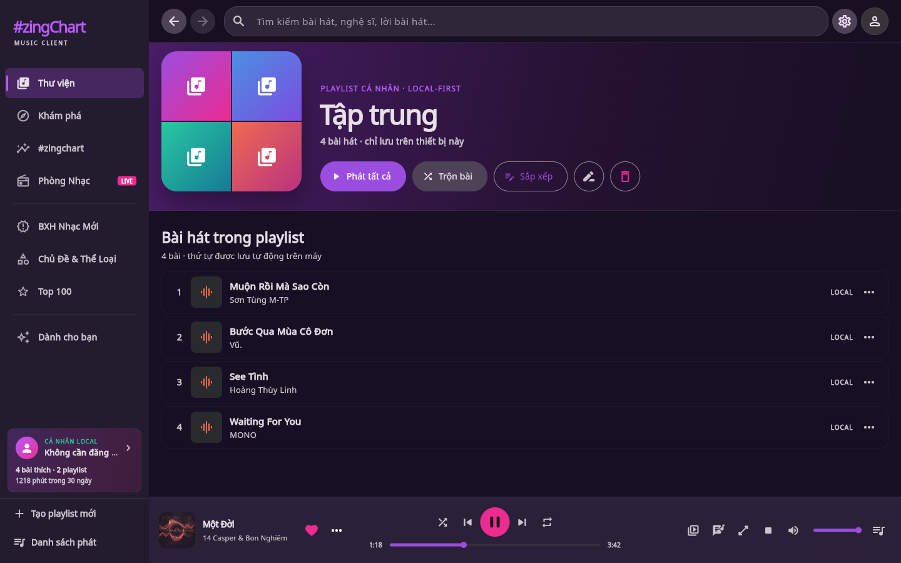
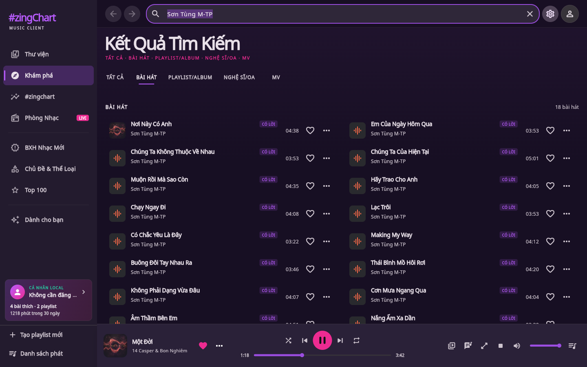

# #zingChart

<p align="center"></p>

[Tiếng Việt](README.md) · [English](README.en.md) · [简体中文](README.zh-CN.md)

文档维护以上三种语言。Flutter 主界面目前以越南语为默认语言；原生桌面组件与
手表遥控器会根据系统语言选择越南语、英语或简体中文标签。

#zingChart 是使用 Flutter 开发的 Local-First 音乐排行榜与播放器。一个代码库
覆盖 Android、Android TV、iOS/iPadOS、Web/PWA、Windows、macOS、Linux、
Amazon Fire OS/Fire TV、LG webOS TV、Samsung Tizen TV 和 HarmonyOS。
客户端不会直接请求 Zing 上游；排行榜数据与音频统一经过自托管 Node 代理。

## 功能

- 实时 Zing Chart：显示排名变化、封面、歌曲名、歌手、专辑与时长；24 小时曲线
  支持悬停、触摸拖动、键盘与电视遥控器，并显示分时占比提示和直接播放入口。
  榜单在前台显示时每两分钟后台刷新；网络中断会保留旧快照并提供重试，应用非活动时停止请求。
  发现页还会内嵌紧凑版 `#zingchart`，同时展示 24 小时曲线与前三名；可沿用完整榜单队列播放，
  或进入完整榜单，而且不会新增网络端点。
  独立加载的官方“推荐”行会排除榜单重复歌曲，提供应用内歌手/专辑链接，且不会上传收藏、收听历史或统计数据。
  列表默认像 Zing MP3 一样只显示前 10 名，可原地“查看 Top 100”，播放队列仍保留完整榜单。
  每位合作歌手与专辑都有独立的悬停/焦点链接，可在应用内打开对应官方内容；
  “歌曲信息”操作会打开详情但不自动播放；详情中的歌手、作曲人与专辑可继续打开应用内
  对应页面，且不会中断当前播放或替换队列。封面在悬停或聚焦时显示播放、锁定或正在播放状态。
  歌曲行的更多按钮与桌面右键共用同一菜单：立即播放、信息、队列、Radio、歌单、分享、
  收藏与心情；受限歌曲仍可查看或保存，但不会显示播放、队列或 Radio 操作。
- 新歌榜：排名变化、专辑、时长、严格播放权限，以及手机/桌面/电视自适应布局。
- 官方周榜：越南、欧美与 K-Pop 三个地区会像 Zing MP3 一样直接显示在发现页，
  每张区域卡都进入对应榜单；完整页面可选择最近八周，显示排名变化、专辑、时长，
  并只用允许播放的歌曲建立队列。
- Zing 风格“最新发行”目录：歌曲/专辑标签，全部、越南、欧美、韩国、其他筛选，
  播放队列仅包含允许播放的歌曲；发现首页还提供 Zing 风格的 12 首三列歌曲区，
  支持全部/越南/国际筛选并可进入完整目录；手机、桌面与电视共用同一歌曲操作菜单，
  桌面端还支持右键打开。
- 发现首页提供 Zing 风格“为你推荐、放松、工作、热门、睡眠、锻炼”分类胶囊；每个
  分类保留 Quick Play、编辑横幅与歌单横向列表；等待网络时，响应式
  Quick Play → 横幅 → 歌曲骨架会在手机、平板、桌面和电视上保持最终内容节奏，
  系统启用“减少动态效果”时进度指示会改为静态；在平板/桌面上，搜索栏会直接衔接分类
  胶囊与 Quick Play，滚动时分类栏固定在工具栏正下方；超大标题、最近搜索词和次要快捷入口不再把核心内容推到首屏以下。
  宽屏桌面通过侧栏导航，不再在内容区重复快捷入口；平板将快捷入口放在优先内容之后，
  手机与电视继续采用适合触控和遥控器的顺序；官方 Top 100 横向列表提供“全部”入口。
  Quick Play 改为 Zing 风格“猜你喜欢”
  Hero：紧凑横向卡片使用左侧方形封面与 coral–plum 渐变，桌面/平板显示两张、
  宽屏电视显示三张，并在手机保留下一张预览；卡片边缘的分页按钮支持鼠标、键盘与遥控器。
  随后的编辑横幅采用低矮、全宽的全景图：官方图片保持原样，不叠加标题或播放按钮，
  手机仍会露出下一张预览；轮播会像 Zing MP3 一样在空闲时自动切换，
  但会在 hover、focus 或触摸拖动时立即暂停，并在系统启用“减少动态效果”时完全静止；
  所有内容横向列表在手机保留滑动操作，并仅在平板、桌面和
  电视发生溢出时显示上一页/下一页按钮，切换分类后安全回到第一张；卡片提供 Zing 风格操作层：主体打开应用内详情，爱心在
  本机保存/取消保存，播放按钮从第一首允许播放的歌曲开始，更多菜单可播放、打开信息、
  保存或分享官方链接；桌面端右键点击卡片会打开同一操作菜单；队列按官方顺序且仅包含
  可播放歌曲；发现内容栏、Hub/Top 100 与新发行专辑
  会把经过验证的每位艺人显示为独立的 hover/focus 链接，打开应用内艺人主页时不会触发
  外层歌单/专辑卡片；
  “热门 MV”横向列表仅展示通过校验的官方视频，手机、网页与桌面打开 Zing 页面，
  电视使用二维码交接；应用不会代理转发或下载 MV 媒体；
  代理会忽略 `adBanner`，不会加载第三方广告网络；
  “歌曲推荐 / 换一批”优先采用 Zing 中允许播放的曲目，服务不可用时回退到设备内
  当前榜单；桌面与电视最多以 3×3 矩阵显示九首歌曲，并在悬停或聚焦时显示操作层；
  手机始终提供更多菜单，可收藏、加入队列/歌单、打开歌曲信息、启动 Radio 或分享；
  桌面右键打开完全相同的菜单，允许播放的歌曲菜单始终包含“立即播放”；
  官方 metadata 会把每位合作歌手保留为可悬停/聚焦的应用内链接，打开歌手主页时
  不会开始播放或替换队列；
  两种路径都不会上传收藏、统计或收听历史。独立的“最近播放”横向列表从
  本地历史读取最多 10 首去重歌曲，使用完全相同的历史队列，并在网络发现服务失败时
  继续可用；每张卡片复用播放、信息、队列、Radio、歌单、分享、收藏与 Mood 菜单，
  桌面支持右键，电视可用遥控器聚焦访问。首页“新歌榜”聚焦前三名，保留锁定状态，
  并只按排名顺序把允许播放的歌曲加入队列；受限歌曲仅保留安全的 metadata/媒体库操作，
  不显示播放、队列或 Radio。
- 主题与流派：按国家、心情和活动浏览，并提供“精选、越南、亚洲、欧美、纯音乐”
  分组的 Top 100 歌单；歌单/专辑上的艺人名称保留类似 Zing 的应用内导航。
- 大屏桌面端采用接近 Zing MP3 信息层级的分组侧栏，包含音乐库、发现、#zingchart、
  LIVE 电台、新歌榜、主题与流派、Top 100 和“为你推荐”；Hub 与 Top 100 可直接打开，
  底部提供“新建歌单”和“播放队列”。返回/前进可保留最多 50 个应用内标签、搜索、
  歌手、专辑/歌单及音乐库分区状态，桌面端支持 `Alt+←/→`。Web 会把语义化目的地同步到
  地址栏与浏览器历史；返回/前进直接恢复内存快照，不会重建播放器、队列或当前歌曲。
  Native 与 TV 继续使用应用内栈，webOS/Tizen 不依赖 History API。平板与桌面端在内容滚动时会固定返回/前进、
  搜索与设置工具栏；“发现”页还会在其下固定分类栏；宽屏桌面提供“个人”头像及侧栏本机资料卡，显示真实的收藏、歌单与收听分钟数，
  并直接打开本机资料，不伪装云端账号。
  平板与 TV 保留导航栏；手机使用五项底部导航：
  `音乐库 · 发现 · #zingchart · 电台 · 个人`。“个人”集中展示仅存于设备的资料、收藏、歌单、
  已关注艺人、Daily/Mood Mix、统计与 Wrapped，无需登录。完整新歌榜继续从“发现”进入，不再额外占用主导航位置。
- 官方歌曲、歌手、歌词、歌单/专辑与 MV 搜索，提供 Zing 风格自动补全（最多四个关键词和六首
  歌曲预览），支持鼠标、键盘和电视遥控器；选择歌曲预览会按公开 song ID 打开歌曲信息，
  不会自动播放，且仅在官方 metadata 确认可播放后显示 Play；逐行加载状态与 request guard
  会阻止过期详情误打开；完整结果继续支持防抖、“全部/歌曲/
  歌单-专辑/歌手/MV”分类、Zing 风格精选卡片、自适应应用内歌手主页和歌单/专辑详情页，并保留 #zingchart
  本地回退。歌单/专辑详情会显示官方收藏量，经过验证的艺人身份支持 hover/focus
  并打开应用内艺人主页；页面还展示发行日期、发行方与流派。歌曲列表之后依次显示圆形头像的
  “参与艺人”栏（支持本地关注与应用内主页），以及官方“出现于”/“你可能也喜欢”内容栏；
  相关内容卡片共用播放、收藏、更多、分享操作，并支持右键、键盘和电视遥控器。
  宽度达到 1200 px 且实际内容区域足够时，
  详情页切换为类似 Zing 的双栏工作区：左侧显示封面、标题、艺人、更新日期与操作；右侧显示
  可展开/收起的简介和歌曲列表。专辑使用“播放全部”、曲目编号且不重复显示专辑列；歌单使用
  “随机播放”并保留专辑列。打开队列/歌词面板后，表格会按实际内容宽度切换为紧凑模式，避免溢出。
  手机端使用更紧凑的 Hero，让第一首曲目直接进入初始视口，仅保留主要艺人与适合触控的
  播放/收藏/更多操作；分享放在“更多”菜单内。宽度低于 480 px 时，每行歌曲只保留一个
  尾部“更多”，点赞仍可从菜单访问，从而为标题留出空间。触控平板沿用相同层级，并按实际
  内容宽度切换横向/纵向；电视继续使用焦点友好的布局。
  艺人主页在 1180 px 起使用贴近 Zing OA 的
  横向全宽紫色 Hero，包含圆形头像、超大艺人名、圆形 Play、关注人数以及关注/分享操作；
  Hero 下方会像官方艺人页一样，把“最新发行”与三首“热门歌曲”并排展示；内容区域受限时
  自动改为上下排列并隐藏次要 metadata，避免溢出。手机/平板/电视继续保留合适的触控密度与焦点目标。
  Single/EP、专辑与合辑栏共用播放、收藏、更多、分享及一致的右键菜单；桌面按实际内容宽度
  显示翻页箭头，手机横向滑动，电视使用 D-pad/Enter。相关艺人可直接在卡片上本地关注。
  等待结果时，自适应骨架屏会在手机、平板、桌面和 TV 上保留
  `精选 → 歌单` 的内容层级；系统启用“减少动态效果”时，进度指示会改为静态。
  “全部”页按 Zing 官方顺序展示
  `精选 → 精选歌单 → 6 首歌曲 → 歌单/专辑 → MV → 艺人/OA`；
  “精选”使用三张等高卡片：一张圆形头像艺人卡与两张方形封面歌曲卡，仅保留 Zing
  显示的内容类型、标题、艺人/关注人数；专辑、时长和详细操作留在下方“歌曲”列表。
  每个分组的“全部”操作都会打开完整列表。艺人/OA 使用贴近 Zing 搜索页的圆形头像
  自适应网格（2/3/5 列），支持 hover、focus 与 TV 遥控器；仅在官方 API 返回真实数据时
  显示关注人数。“歌曲”页使用类似 Zing 的紧凑行，包含 40 px 封面、艺人与两位数时长；
  宽屏桌面采用双栏网格并始终提供喜欢/更多操作，单栏布局仅在内容宽度充足时保留专辑
  metadata。“歌单/专辑”页使用轻微圆角的
  方形封面、单行标题、最多两行艺人信息和 2/3/4/5 列自适应网格；Zing 风格播放层仅在
  hover/focus 时出现，同时整张卡仍可通过触摸、点击、Enter 或电视遥控器打开详情。“MV”页使用
  16:9 缩略图、两位数时长、经过验证的官方艺人头像和单行 metadata；播放层同样仅在
  hover/focus 时出现，随后打开可信的 Zing/电视二维码交接。
  四个分类页使用官方分页 contract，每页最多 18 项；手机、平板与桌面端在接近列表末尾时自动加载，
  可访问的“查看更多”仍作为失败回退，并作为电视端的主要控制。加载失败时会保留已有结果，
  并按公开 ID 去重。代理未配置签名凭据时，客户端保留“全部”预览并隐藏分页，不会猜测更多结果。
  “全部播放”只用代理允许播放的曲目建立队列；播放器还支持播放/暂停/
  停止、进度跳转、上一首/下一首、随机、循环、音量/静音、队列和睡眠定时。
  “播放来源”标题会保留真实队列上下文，例如 #zingchart、搜索、专辑、歌手、周榜、
  新发行、音乐库、Song Radio 或 LIVE，并在上一首/下一首及本地会话恢复后继续保留。
  流媒体质量是真实的并写入签名中继 URL：自动模式优先 320 kbps、必要时回退
  128，省流量模式固定 128，高品质模式只接受可用的 320 kbps 音源。若 320 音源
  失败，Now Playing 可重试或一键切回 Auto，同时保留当前歌曲与队列。
- 桌面端选择歌曲后默认保留目录内容，并显示类似 Zing MP3 的横向播放坞，包含歌曲
  信息、播放控制、进度、音量，以及官方 MV、歌词/卡拉 OK、Now Playing 和“播放队列”
  快捷入口。收藏旁的“更多选项”可打开歌曲信息、Song Radio、加入歌单和分享 Zing
  官方链接。MV 元数据仅在用户点击后加载，并继续使用经过校验的 Zing 交接流程；窄桌面
  会隐藏扩展快捷键，为播放控制保留空间。右侧抽屉包含“播放队列”“最近播放”与
  “歌词”三个标签：队列可播放、拖动排序、逐首移除，也可在手机、桌面和电视上经确认后
  清空待播歌曲，同时保留当前歌曲、进度与播放来源。历史仅保存在本机；同步歌词自动跟随
  当前句、点击可跳转，并可展开全屏卡拉 OK。抽屉打开时底部播放坞仍保持可见。
  抽屉可通过关闭按钮或 Esc 收起，同时保留全屏播放选项；手机继续使用紧凑迷你播放器，
  电视保留遥控优先的 10-foot 控制面板。
- 手机迷你播放器遵循 Zing 的层级：顶部细进度线、封面、歌曲/歌手信息、播放/暂停与
  下一首，统一放在五标签导航上方的 76 px 播放条中。停止操作保留在完整“正在播放”
  页面，避免在高频点击的迷你区域放置破坏性播放操作。
- 顶部“设置”在手机上打开底部面板，在平板、桌面和电视上打开对话框，统一管理
  主题、随机、Smart Shuffle、循环、Song Radio 自动播放、睡眠定时、桌面端始终全屏打开“正在播放”、
  Auto/128/320 kbps 音质以及 Local-First 计数。所有选项都连接真实控制器并保存在
  本机，不包含占位开关。
- 手机“正在播放”采用更接近 Zing MP3 的层级：封面与歌曲信息保持核心位置，真实的
  Auto/128/320 kbps 徽标可直接打开音质选择器，基础播放控制独立呈现，歌词、队列、
  Song Radio 与睡眠定时位于固定操作坞中。歌曲信息、Smart Shuffle 和驾驶模式保留在
  紧凑工具组；当前播放最高为 320 kbps 时，应用不会误标为 Lossless。
- 驾驶模式可从“设置”或“正在播放”开启，保留封面、进度以及大尺寸的上一首、播放、
  下一首和停止按钮，同时减少次要操作；状态只保存在本机。这是应用内的低干扰界面，
  并不表示已集成 Android Auto 或 Apple CarPlay。
- 播放器内的歌曲信息页展示官方歌手、专辑、发行日期、发行方、流派、作曲者、
  播放量、收藏量和评论数。MV 只打开经过验证的 Zing 官方页面；电视和不支持
  外部启动器的平台使用二维码/复制交接。
- 支持分享歌曲、歌手和歌单/专辑的 Zing MP3 官方链接；手机、网页和桌面优先使用
  系统分享面板，电视及不支持分享适配器的平台使用二维码与复制。分享内容不包含
  本地收听历史、收藏或统计数据。
- 可在应用内直接打开 Zing MP3 官方链接：把 URL 粘贴到搜索框即可进入歌曲、歌手、
  MV、专辑/歌单、Hub、Top 100、周榜、新歌榜或直播房间。歌曲链接只打开信息页并等待用户
  主动点击播放；`/video-clip/` 链接会显示确认交接，用户可主动打开 Zing MP3，
  TV 则只显示二维码。外部启动不会自动播放。Android 仅注册 best-effort HTTPS 交接；
  iOS、macOS、Windows、Linux 与 HarmonyOS 使用 `zingchart://open?url=...`；Web
  接受编码后的 `?open=<URL>` 查询。解析器只接受已知的 Zing HTTPS 主机和路径，不会
  把任意 URL 转发给代理。
- 手机/桌面“正在播放”和歌单详情会复用已加载封面作为模糊渐变氛围层；对比遮罩与
  本地渐变确保可读性，不增加 API 请求，也不发送个人数据。
- Launcher、PWA、桌面、手表与 TV 共用原创的“# + 脉冲”图标，并沿用
  ink/coral/lime 配色。Android 同时提供 adaptive 与 monochrome 图层；Apple
  资源为无 Alpha 的 RGB PNG，所有尺寸可通过
  `node tool/generate_brand_assets.mjs` 统一生成。
- Song Radio 可从歌曲菜单或“正在播放”加载最多 30 首获授权的相似歌曲；播放到
  队列末尾时，自动播放可以继续扩展队列。
- Smart Shuffle 从当前已加载的目录中穿插最多 10 首推荐，使用设备端点赞与统计排序，
  并为每首自动加入的歌曲标记 `SMART`；收听偏好、收藏和历史不会发送到代理。
- LIVE 电台展示 V-Pop、Bolero、欧美、K-Pop 及当前节目；HLS 播放列表和媒体均
  通过同源代理重写与转发，不向客户端暴露 CDN 地址。
- 沉浸式歌词/Karaoke 界面在上游提供逐词时间戳时按词高亮，同时保留逐行自动滚动与
  点击跳转；缺少逐词时间时自动回退到逐行同步或纯文本。
- Lyric Card 可选择最多四句歌词、预览后通过各平台的分享/下载/保存路径导出本地 PNG；
  电视使用设备端二维码。渲染不请求封面，也不会把歌词、历史或统计上传到代理。
- 系统支持范围内的后台播放、锁屏与系统媒体控制。
- Local-First 音乐库提供接近 Zing 的“总览、歌曲、歌单、专辑、歌手”五个分区；
  本地收藏、已关注歌手/OA、已保存的 Zing 专辑/歌单、个人歌单、收听历史、
  最近搜索、Daily/Mood Mix、7/30 天及年度统计都无需账号并只保存在设备上。
- 个人歌单拥有独立的拼贴封面工作区，支持播放/随机播放、重命名、删除、手机与桌面
  拖放排序、电视端上移/下移，以及按原位置撤销删除。选择器可在不离开当前目录的
  情况下创建并立即加入歌曲；编辑歌单不会改动正在播放的队列。
- 全年可查看的六页 Mini Wrapped，并可导出 PNG 或 TV 本地二维码摘要。
- JSON v3 备份，支持幂等合并与完全覆盖，也能读取 v1/v2。
- 手机、平板、桌面和电视自适应 UI，保留 charcoal/coral/lime 视觉语言。
- 目录使用独立更新信号：播放进度、时长和音量变化只重建播放器，不再重建整个首页、
  发现页或排行榜；收藏、队列与媒体库变更仍会立即更新。

### 打开 Zing MP3 链接

- 在应用搜索框点击链条图标粘贴 URL，也可以直接粘贴后按 Enter/Search。
- 官方 `/tim-kiem/tat-ca`、`/tim-kiem/bai-hat`、`/tim-kiem/playlist`、
  `/tim-kiem/artist` 与 `/tim-kiem/video` URL（且仅含一个 `q` 参数）会直接
  打开对应查询和分类，不会重启播放器。
- `https://zingmp3.vn/video-clip/.../<id>.html` 格式的 MV 链接始终等待用户
  主动点击“打开 Zing MP3”；TV 仅提供二维码/复制，避免启动器循环。
- 跨平台 scheme：
  `zingchart://open?url=https%3A%2F%2Fzingmp3.vn%2Ftop100`。
- Web/PWA：
  `https://<client-host>/?open=https%3A%2F%2Fzingmp3.vn%2Ftop100`。
- 常规 Web 构建使用 `PathUrlStrategy` 与已配置的 `<base href>`。若要从
  `/new-release/album` 等直接路径冷启动，托管端必须将该路径 rewrite 到
  `index.html`。
- `open` 参数中的 Zing 官方目标会统一为主域 `https://zingmp3.vn`，移除
  fragment/tracking，并保留 `/new-release/song` 与 `/new-release/album` 等 subtype；
  地址栏仍使用客户端 host。发现、Hub、音乐库和“为你推荐”分别使用
  `?view=discovery`、`?view=hubs`、`?view=library` 与 `?view=for-you`；音乐库
  只会保留分区与不透明的本地播放列表 ID，不写入播放列表名称或收听数据。
- 只有已提交的语义化导航才新增历史条目。输入过程中的临时搜索结果会通过 replace
  合并到同一个条目；分页、滚动、seek 与队列变化不会填满浏览器历史。
- Android HTTPS 交接属于 best-effort：部分设备或旧版系统可能显示选择器，Android
  12+ 通常会用默认浏览器打开未验证域名。稳定入口是自定义 scheme 或粘贴操作。
  由于域名归 Zing MP3 所有，本项目不声称拥有已验证的 Android App Link 或 Apple
  Universal Link。

在获得合法音源和存储许可前，不提供离线音频下载。PWA 只缓存应用外壳和非音频数据。

## 按版本展示界面

以下图片由当前 UI 使用稳定、完全本地的演示数据渲染，再按功能里程碑分组。
它们不是旧版本二进制文件的历史截图，也不包含真实用户数据。

### v1.0 — 排行榜、播放器与跨平台音乐库

<table>
  <tr>
    <td width="33%" align="center"><br><sub><b>首页</b> · 实时排行榜与 Daily Mix</sub></td>
    <td width="33%" align="center"><br><sub><b>搜索</b> · 歌曲、歌手与最近关键词</sub></td>
    <td width="33%" align="center"><br><sub><b>正在播放</b> · 进度、队列、心情与睡眠定时</sub></td>
  </tr>
  <tr>
    <td align="center"><br><sub><b>音乐库</b> · 收藏、歌单与本地备份</sub></td>
    <td colspan="2" align="center"><br><sub><b>桌面自适应</b> · 排行榜、正在播放与队列同屏</sub></td>
  </tr>
</table>

### v1.1 — Local Intelligence

<table>
  <tr>
    <td width="33%" align="center"><br><sub><b>为你推荐</b> · 设备端 Daily Mix 与 Mood Mix</sub></td>
    <td width="33%" align="center"><br><sub><b>统计</b> · 7 天、30 天与年度视图</sub></td>
    <td width="33%" align="center"><br><sub><b>Mini Wrapped</b> · 六页总结与 PNG 导出</sub></td>
  </tr>
  <tr>
    <td colspan="3" align="center"><br><sub><b>电视 10-foot UI</b> · 遥控导航、本地 Mix 与播放器面板</sub></td>
  </tr>
</table>

### v1.2 — Zing MP3 曲库发现

<table>
  <tr>
    <td colspan="2" align="center"><br><sub><b>桌面曲库工作区</b> · 同屏显示 24 小时曲线、支持应用内歌手/专辑导航的官方推荐、榜单元数据与播放坞</sub></td>
  </tr>
  <tr>
    <td colspan="2" align="center"><br><sub><b>Zing MP3 风格播放坞与队列抽屉</b> · 直达 MV、歌词/卡拉 OK、Now Playing 与歌曲操作；队列可排序，历史仅在本机</sub></td>
  </tr>
  <tr>
    <td colspan="2" align="center"><br><sub><b>曲库旁的同步歌词</b> · 跟随当前句、点击跳转，或展开全屏卡拉 OK，无需离开正在浏览的页面</sub></td>
  </tr>
  <tr>
    <td colspan="2" align="center"><br><sub><b>Zing 风格 Local-First 音乐库</b> · 五个自适应分区、个人歌单与已保存官方内容，无需账号</sub></td>
  </tr>
  <tr>
    <td colspan="2" align="center"><br><sub><b>Local-First 个人歌单</b> · 拼贴封面、播放/随机播放、重命名、删除、排序与撤销，不影响正在播放的队列</sub></td>
  </tr>
  <tr>
    <td colspan="2" align="center"><br><sub><b>24 小时榜单脉搏</b> · 通过悬停、触摸拖动或遥控器查看每小时占比并播放当前歌曲</sub></td>
  </tr>
  <tr>
    <td colspan="2" align="center"><br><sub><b>Top 10 → Top 100</b> · 默认紧凑、原地展开，并始终保留完整榜单队列</sub></td>
  </tr>
  <tr>
    <td width="50%" align="center"><br><sub><b>发现</b> · Zing 风格左侧封面、无文字叠层全景图与无障碍轮播控制</sub></td>
    <td width="50%" align="center"><br><sub><b>新歌榜</b> · 应用内歌手/专辑导航、排名趋势、时长，以及仅包含可播放歌曲的队列</sub></td>
  </tr>
  <tr>
    <td colspan="2" align="center"><br><sub><b>热门 MV</b> · 自适应 16:9 卡片、经过校验的 Zing 页面与电视二维码交接</sub></td>
  </tr>
  <tr>
    <td colspan="2" align="center"><br><sub><b>首页最新发行</b> · 12 首歌曲、全部/越南/国际筛选，并自动排除锁定歌曲</sub></td>
  </tr>
  <tr>
    <td colspan="2" align="center"><br><sub><b>最近播放</b> · 设备内私密历史、去重队列，不上传代理</sub></td>
  </tr>
  <tr>
    <td colspan="2" align="center"><br><sub><b>新歌榜前三名</b> · 自适应焦点区、锁定状态与仅包含可播放歌曲的队列</sub></td>
  </tr>
  <tr>
    <td colspan="2" align="center"><br><sub><b>搜索自动补全</b> · 歌曲预览先打开歌曲信息，再由用户主动播放；支持鼠标、键盘与电视遥控器</sub></td>
  </tr>
  <tr>
    <td colspan="2" align="center"><br><sub><b>全部 · 精选</b> · 一位艺人、两首歌曲、真实关注人数与 1/2/3 列自适应布局</sub></td>
  </tr>
  <tr>
    <td colspan="2" align="center"><br><sub><b>歌曲 · 官方分页</b> · 每页 18 项并采用桌面双栏；手机/平板/桌面接近末尾自动加载，同时保留“查看更多”作为回退和电视遥控入口</sub></td>
  </tr>
  <tr>
    <td colspan="2" align="center"><br><sub><b>官方 MV 搜索</b> · 16:9 封面、时长、艺人头像与 hover/focus 浮层；通过可信 Zing 链接或电视二维码打开</sub></td>
  </tr>
  <tr>
    <td width="50%" align="center"><br><sub><b>主题与流派</b> · 自适应 Hub 导航并打开歌单/专辑详情</sub></td>
    <td width="50%" align="center"><br><sub><b>Top 100</b> · 精选、越南、亚洲、欧美与纯音乐歌单</sub></td>
  </tr>
  <tr>
    <td colspan="2" align="center"><br><sub><b>最新发行</b> · 每首歌曲显示可导航的歌手/专辑及时长，并提供专辑标签、市场筛选、发行时间与默认拒绝播放策略</sub></td>
  </tr>
  <tr>
    <td colspan="2" align="center"><br><sub><b>艺人/OA</b> · 全宽 Hero 与双栏最新发行/热门歌曲；“全部”可在应用内打开最多 50 首歌曲、Single & EP 或 MV</sub></td>
  </tr>
  <tr>
    <td colspan="2" align="center"><br><sub><b>关注艺人</b> · 无需账号，使用 backup v3 恢复，并可从音乐库重新打开</sub></td>
  </tr>
  <tr>
    <td colspan="2" align="center"><br><sub><b>艺人目录</b> · 合集提供播放/收藏/更多/分享，MV 使用独立播放浮层；支持鼠标、滑动、键盘与电视遥控器</sub></td>
  </tr>
  <tr>
    <td width="34%" align="center"><br><sub><b>手机合集</b> · 适合触控的播放/收藏/更多、菜单内分享，以及每行唯一的尾部 overflow</sub></td>
    <td width="66%" align="center"><br><sub><b>桌面专辑/歌单</b> · 按内容类型显示 CTA、专辑编号或歌单专辑列、受限歌曲 fail-closed，收藏状态继续保持本地优先</sub></td>
  </tr>
  <tr>
    <td colspan="2" align="center"><br><sub><b>歌单/专辑信息</b> · 紧凑 metadata、支持本地关注的参与艺人，以及带播放/收藏/分享操作的相关内容栏</sub></td>
  </tr>
  <tr>
    <td colspan="2" align="center"><br><sub><b>周榜</b> · 越南/欧美/K-Pop、应用内歌手/专辑导航、排名变化、时长与仅含可播放歌曲的队列</sub></td>
  </tr>
  <tr>
    <td colspan="2" align="center"><br><sub><b>歌曲信息</b> · 元数据、互动数据、应用内歌手/专辑导航、官方链接分享与 MV 交接</sub></td>
  </tr>
  <tr>
    <td colspan="2" align="center"><br><sub><b>Karaoke 与歌词</b> · 大封面、逐词同步、点击跳转，并适配手机/桌面/电视</sub></td>
  </tr>
  <tr>
    <td colspan="2" align="center"><br><sub><b>Lyric Card</b> · 最多选择四句、在设备端渲染 PNG，并在电视上使用本地二维码</sub></td>
  </tr>
  <tr>
    <td colspan="2" align="center"><br><sub><b>驾驶模式</b> · 易于快速查看的信息、清晰进度，以及大尺寸上一首/播放/下一首/停止控件</sub></td>
  </tr>
  <tr>
    <td colspan="2" align="center"><br><sub><b>Song Radio</b> · 获授权推荐、自动扩展队列，以及手机/桌面/电视控制</sub></td>
  </tr>
  <tr>
    <td colspan="2" align="center"><br><sub><b>Smart Shuffle</b> · 穿插本地优先推荐、保留原始歌曲，并明确标记每首自动加入的歌曲</sub></td>
  </tr>
  <tr>
    <td colspan="2" align="center"><br><sub><b>真实在线音质</b> · Auto 优先 320 后回退 128；明确选择 128/320 时，签名中继会保持该码率</sub></td>
  </tr>
  <tr>
    <td colspan="2" align="center"><br><sub><b>LIVE 电台</b> · 直播房间、当前节目、听众人数，以及手机/桌面/电视同源 HLS</sub></td>
  </tr>
</table>

用于重建图片库的稳定 fixture 位于
[`tool/docs_screenshot_app.dart`](tool/docs_screenshot_app.dart)。该入口不会
请求代理、真实音频或操作系统媒体服务。
跨平台图标源文件为
[`assets/brand/zingchart-mark.svg`](assets/brand/zingchart-mark.svg)；运行
`node tool/generate_brand_assets.mjs --check` 可检测缺失或过期的生成资源。

## 桌面组件与智能手表

| 界面 | 最低版本/支持范围 | 控制 |
| --- | --- | --- |
| Android 桌面组件 | Android 手机/平板 | 上一首、播放/暂停、下一首 |
| Fire OS 平板 | 已包含在 Android APK；是否可添加取决于 Launcher | 上一首、播放/暂停、下一首 |
| iOS/iPadOS WidgetKit | iOS/iPadOS 17+ | App Intent 交互控制 |
| macOS WidgetKit | macOS 14+ | 上一首、播放/暂停、下一首 |
| HarmonyOS 服务卡片 | HarmonyOS 5.1/API 18 | 上一首、播放/暂停、下一首 |
| Wear OS 遥控器 | Wear OS 3+，与 Android 配对 | Data Layer 本地 RPC |
| watchOS 遥控器 | watchOS 10+，与 iPhone 配对 | WatchConnectivity 本地 RPC |
| Windows/Linux/Web/TV | v1 没有统一桌面组件 API | 使用现有 SMTC、MPRIS、Media Session 或 TV 遥控 |

所有组件和手表只接收节流后的版本化播放状态及控制指令，不接收历史、收藏、
流地址或分析数据，也不会把手表数据发送到代理。

## 架构

```text
Flutter UI + PlaybackService
        │
        ├── SystemMediaBridge → 锁屏 / SMTC / MPRIS / Media Session
        ├── CompanionBridge   → 桌面组件 / Wear OS / watchOS
        └── MusicRepository   → 自托管 Node/Fastify 代理
                                      │
                                      ├── 排行榜、自动补全与目录搜索 → Zing 上游
                                      ├── 授权周榜请求     → Zing 上游
                                      ├── 授权同步歌词     → Zing 上游
                                      ├── 授权 Song Radio  → Zing 上游
                                      ├── 授权 LIVE 电台   → Zing 上游
                                      ├── 加密 HLS 中继    → Zing CDN
                                      └── 签名音频中继     → Zing 上游
```

主要目录：`lib/` 为 Flutter 应用，`proxy/` 为代理，`android/wear/` 为
Wear OS，`ios/ZingChartWatch/` 和 `ios/ZingChartWidget/` 为 Apple 配套目标，
`macos/ZingChartWidget/` 为 macOS 组件，`packaging/` 为各平台打包脚本。

## 环境要求

- Git、FVM、Flutter `3.44.7` 与随附 Dart `3.12.2`。
- Node.js `22+` 或 Docker；一个设备可访问的代理 URL，正式版必须 HTTPS。
- Android：Android SDK 36、JDK 17+。
- Apple：macOS、完整 Xcode、CocoaPods、Ruby gem `xcodeproj 1.27.0`。
- Windows：Visual Studio 2022 与 Desktop development with C++。
- Linux：Clang、CMake、Ninja、GTK 3、LZMA 和 GStreamer 开发包。
- HarmonyOS：CPF-Flutter `3.41.10-ohos-1.0.0`、Dart `3.11.5`、
  DevEco 工具及 HarmonyOS SDK 5.1/API 18。

## 首次安装与本地运行

```sh
git clone https://github.com/LamPPKK/Zing-Chart.git
cd Zing-Chart
fvm install 3.44.7
fvm use 3.44.7
fvm flutter pub get
```

启动开发代理：

```sh
cd proxy
cp .env.example .env
set -a
. ./.env
set +a
npm ci
npm run dev
```

在另一个终端验证并运行客户端：

```sh
curl http://localhost:8080/health
curl http://localhost:8080/v1/chart
curl http://localhost:8080/v1/charts/new-releases
curl 'http://localhost:8080/v1/charts/weekly?region=vietnam'
curl 'http://localhost:8080/v1/charts/weekly?region=korea&week=33&year=2026'
curl http://localhost:8080/v1/discovery/categories
curl http://localhost:8080/v1/discovery/recommendations
curl 'http://localhost:8080/v1/discovery/home?categoryId=-1'
curl 'http://localhost:8080/v1/discovery/home?categoryId=14'
curl http://localhost:8080/v1/hubs
curl http://localhost:8080/v1/hubs/IWZ9Z09B
curl http://localhost:8080/v1/top-100
curl http://localhost:8080/v1/releases
curl http://localhost:8080/v1/artists/Son-Tung-M-TP
curl --get http://localhost:8080/v1/search --data-urlencode 'q=Sơn Tùng M-TP'
curl --get http://localhost:8080/v1/search --data-urlencode 'q=Sơn Tùng M-TP' \
  --data 'type=songs&page=1&limit=18'
curl http://localhost:8080/v1/collections/6DIZIU79
curl http://localhost:8080/v1/songs/ZW79ZBE8/detail
curl http://localhost:8080/v1/songs/Z9WE0E96/lyrics
curl http://localhost:8080/v1/songs/Z9WE0E96/radio
curl http://localhost:8080/v1/radio
curl http://localhost:8080/v1/radio/IWZ979UB/source
cd ..
fvm flutter devices
fvm flutter run -d <device-id> \
  --dart-define=API_BASE_URL=http://localhost:8080
```

真机、电视和正式版应使用设备可访问的 HTTPS 代理。
`https://api.example.invalid` 只是安全诊断占位符，不会回退为直连 Zing。

配置获授权的 current-API 凭据后，完整搜索请求只在代理端签名，并返回歌曲
（含歌词能力）、歌手/OA、歌单/专辑与公开 MV metadata。歌曲只有在
`streamingStatus = 1` 时才允许播放。MV 不会被代理转发或下载；客户端只打开
通过校验的官方 `zingmp3.vn/video-clip/` 页面，电视与缺少 adapter 的平台使用
二维码/复制链接交接。未配置凭据时，legacy 搜索保持兼容响应结构，但不会推断
目录歌曲的播放权限，也不返回 MV。歌单详情由代理从公开 metadata 和 track list
规范化；当前榜单歌曲会复用可播放的 legacy code，current-API 凭据始终仅保存在
服务端，不会写入 Flutter 包。
加入 `type=songs|artists|collections|videos&page=1&limit=18` 可请求官方分类页。
代理按完整 query/type/page/limit 组合缓存并合并并发请求，只在歌曲页叠加榜单
source code；未配置签名 adapter 时返回 `SEARCH_PAGINATION_UNAVAILABLE`。
客户端会保留 aggregate 预览，且搜索请求绝不包含收听历史、收藏或 analytics。
新歌榜同样需要该授权适配器；代理会短期缓存，并且只有
`streamingStatus = 1` 的歌曲才标记为可播放。
官方周榜由 `GET /v1/charts/weekly` 提供，地区值为 `vietnam`、`usuk` 或
`korea`。`week` 与 `year` 必须同时提供；两者都省略时由上游返回最新一期。
请求只在服务端签名，按地区/期数 single-flight 缓存，并且只有
`streamingStatus = 1` 的歌曲才允许播放。
`GET /v1/songs/{code}/lyrics` 只在代理端签名歌词请求，把卡拉 OK 句子
规范化为带 `startTimeMs`/`endTimeMs` 的行；没有时间戳时回退为纯文本。
Flutter 不会直接请求外部歌词文件，结果按歌曲代码进行缓存和 single-flight 合并。
`GET /v1/songs/{code}/radio` 只在代理端签名推荐请求，最多保留 30 首不重复、
非私有、非预发布且 `streamingStatus` 严格等于 `1` 的歌曲。结果采用短期
single-flight 缓存；收藏、统计与本地收听历史绝不会上传。
`GET /v1/radio` 返回规范化的 LIVE 电台目录。其 source 接口仅返回加密的
first-party token；代理会对 HLS 播放列表、密钥、初始化映射和媒体分片执行
allowlist 校验，并改写到 `/v1/live-streams/{opaqueToken}`。Flutter 不会收到
CDN 地址或凭据，LIVE 会话也不会写入统计、历史、推荐或本地备份。
发现首页使用同一套服务端授权适配器，规范化 Quick Play、编辑横幅、Top 100、
Chill 与热门专辑，并忽略第三方 `adBanner` 数据；结果按
`SEARCH_CACHE_TTL_MS` 进行 single-flight 缓存。打开卡片时复用现有歌单详情
流程，本地收听历史和统计不会上传。

“最近播放”横向列表完全由 Flutter 从设备内历史直接生成，属于 Local-First 数据；
代理没有对应接口、参数或 payload。清除收听历史会同时清空该列表，但不会影响收藏。
其操作菜单复用其他歌曲行的同一 contract，且不会通过网络发送本地历史。
`GET /v1/discovery/recommendations` 在代理端签名匿名 Song Station 请求，最多
保留 12 首 `streamingStatus = 1` 的公开歌曲。请求不包含 installation ID 或
本地画像；接口不可用时，客户端会回退到设备内当前榜单。
主题与流派首页、Hub 详情和 Top 100 分别通过 `/v1/hubs`、
`/v1/hubs/{id}` 与 `/v1/top-100` 提供。它们保留上游顺序、丢弃异常卡片，
共用获授权适配器和 single-flight 缓存，并且不会接收本地历史或统计数据。

`GET /v1/releases` 合并最新歌曲与专辑目录，统一映射越南、欧美、韩国和其他地区；
只有 `streamingStatus` 严格等于 `1` 时歌曲才标记为可播放。该接口采用短期
single-flight 缓存，且不会接收客户端收听历史或个人数据。发现首页复用该快照
展示最多 12 首歌曲；“国际”会合并越南以外的地区，播放队列始终排除锁定歌曲。

`GET /v1/artists/{alias}` 返回权威的艺人/OA 主页，包括官方元数据、关注人数、
6 首热门歌曲、最多 50 首来自签名艺人曲库的歌曲、用于“全部”页面的最多 50 个
公开 MV、单曲、专辑、精选集、相关艺人与纯文本简介。应用会把官方
`/{alias}/bai-hat`、`/{alias}/single` 和 `/{alias}/video` 链接路由到内部
分区，总览中的每组均提供“全部”操作。若完整曲库请求失败，代理会保留热门歌曲
分区作为回退。代理会限制每组数量、
丢弃异常子项，仅在 `streamingStatus = 1` 时允许播放，并按 alias 进行
single-flight 缓存，签名凭据不会暴露给客户端。

## 测试

```sh
fvm dart format --output=none --set-exit-if-changed lib test
fvm flutter analyze
fvm flutter test --reporter expanded

cd proxy
npm ci
npm run typecheck
npm test
npm run build
cd ..

node --test \
  packaging/apple/*.test.mjs \
  packaging/fireos/*.test.mjs \
  packaging/harmonyos/*.test.mjs \
  packaging/tv/*.test.mjs \
  packaging/wearos/*.test.mjs
```

## 各平台构建

以下命令中的 URL 和版本需替换为真实值：

```sh
API_BASE_URL=https://proxy.example.com
VERSION=1.1.0
```

### Android、Android TV 与桌面组件

```sh
fvm flutter build apk --release \
  --dart-define=API_BASE_URL="$API_BASE_URL"
fvm flutter build appbundle --release \
  --dart-define=API_BASE_URL="$API_BASE_URL"
```

输出位于 `build/app/outputs/flutter-apk/app-release.apk` 和
`build/app/outputs/bundle/release/app-release.aab`。APK 已包含桌面组件和可选
Leanback 入口。电视侧载测试可增加 `--dart-define=TV_MODE=true`。

正式签名需把 keystore 放在 `android/app/release.jks`，并创建不纳入 Git 的
`android/key.properties`：

```properties
storeFile=release.jks
storePassword=YOUR_STORE_PASSWORD
keyAlias=YOUR_KEY_ALIAS
keyPassword=YOUR_KEY_PASSWORD
```

### Wear OS 遥控器

先构建 Android 应用以生成共享版本信息，再运行：

```sh
./android/gradlew -p android :wear:assembleRelease
```

输出：`build/wear/outputs/apk/release/wear-release.apk`。手机与手表 APK 使用
同一个 application ID `software.baycho.zmp3chart`，并且必须由同一证书签名。
分别安装到已配对的设备，先打开手机应用，再启动手表上的 **#zingChart Remote**。

### iOS/iPadOS WidgetKit 与 watchOS

```sh
gem install xcodeproj -v 1.27.0 --no-document
ruby packaging/apple/prepare_ios_companions.rb
fvm flutter build ios --release --no-codesign \
  --dart-define=API_BASE_URL="$API_BASE_URL"
```

`Runner.app` 会嵌入 `ZingChartWidget.appex` 和 `ZingChartWatch.app`。签名发布需注册：

- App Group：`group.software.baycho.zmp3chart.shared`；
- bundle ID：`software.baycho.zmp3chart.widget`；
- bundle ID：`software.baycho.zmp3chart.watchkitapp`；
- Runner、Widget、Watch 三个独立 provisioning profile，归属同一 Team。

交互组件要求 iOS/iPadOS 17+，手表遥控器要求 watchOS 10+。手表只控制
iPhone 播放，不下载音频。

### Web/PWA

```sh
fvm flutter build web --release \
  --dart-define=API_BASE_URL="$API_BASE_URL"
python3 -m http.server 8081 --directory build/web
```

部署到 `/app/` 子路径时，必须使用匹配的 base href：

```sh
fvm flutter build web --release \
  --base-href /app/ \
  --dart-define=API_BASE_URL="$API_BASE_URL"
```

以 HTTPS 部署 `build/web/`，并把未知路由回退到 `index.html`。浏览器自动播放和
后台限制仍然有效；关闭标签页会停止播放。以上 `/app/` 示例应将 `/app/*`
rewrite 到 `/app/index.html`。

### Windows

仅在 Windows 构建：

```powershell
flutter config --enable-windows-desktop
flutter build windows --release `
  --dart-define=API_BASE_URL="https://proxy.example.com"
.\packaging\windows\package_windows.ps1 -Version 1.1.0
.\packaging\windows\package_msix.ps1 -Version 1.1.0
```

这是打包后的 Flutter Win32 应用，不是 UWP runner。系统控制使用 SMTC；v1 不包含
Windows Widget provider。

### macOS 与 WidgetKit

```sh
fvm flutter config --enable-macos-desktop
gem install xcodeproj -v 1.27.0 --no-document
ruby packaging/apple/prepare_macos_widget.rb
fvm flutter build macos --release \
  --dart-define=API_BASE_URL="$API_BASE_URL"
./packaging/macos/package_macos.sh
```

组件要求 macOS 14+ 和共享 App Group。公开分发还需 Developer ID 签名、
hardened runtime、公证和 stapling。

### Linux x64

```sh
sudo apt-get install -y clang cmake ninja-build pkg-config libgtk-3-dev \
  liblzma-dev libfuse2 libgstreamer1.0-dev \
  libgstreamer-plugins-base1.0-dev
fvm flutter build linux --release \
  --dart-define=API_BASE_URL="$API_BASE_URL"
./packaging/linux/package_linux.sh "$VERSION"
```

脚本生成 portable tar.gz 与 DEB；提供已验证的 `LINUXDEPLOY` 时再生成 AppImage。

### Amazon Fire OS 与 Fire TV

```sh
FIREOS_FLUTTER_BIN="$(fvm which flutter)" FIREOS_BUILD_NUMBER=1 \
  ./packaging/fireos/build_fireos.sh "$API_BASE_URL" "$VERSION" touch
FIREOS_FLUTTER_BIN="$(fvm which flutter)" FIREOS_BUILD_NUMBER=1 \
  ./packaging/fireos/build_fireos.sh "$API_BASE_URL" "$VERSION" tv
```

Touch/TV 的 versionCode 分别为 `2N` 和 `2N+1`。Fire TV 不提供桌面组件；
Fire 平板能否放置组件取决于 Amazon Launcher。

### LG webOS 与 Samsung Tizen TV

```sh
TV_FLUTTER_BIN="$(fvm which flutter)" \
  ./packaging/tv/build_tv_web.sh webos "$API_BASE_URL" "$VERSION"
TV_FLUTTER_BIN="$(fvm which flutter)" \
  ./packaging/tv/build_tv_web.sh tizen "$API_BASE_URL" "$VERSION"
./packaging/tv/package_tizen.sh YOUR_SAMSUNG_CERT_PROFILE
```

webOS 需要 `@webos-tools/cli@3.2.5`；Tizen 需要 Tizen Studio、TV Extension
及 Samsung 证书。文件型 TV 客户端使用 `null` origin，应只在专用代理 CORS
allowlist 中显式允许。

### HarmonyOS 手机/平板与服务卡片

```sh
export HARMONY_FLUTTER_BIN=/opt/flutter-ohos/bin/flutter
export DEVECO_SDK_HOME=/opt/HarmonyOS/sdk
export PATH="/opt/DevEco-Studio/tools/ohpm/bin:/opt/DevEco-Studio/tools/hvigor/bin:/opt/DevEco-Studio/tools/node/bin:$PATH"
HARMONY_BUILD_NUMBER=1 \
  ./packaging/harmonyos/build_harmonyos.sh "$API_BASE_URL" "$VERSION"
```

隔离 runner 会注入 `2×4` 服务卡片、本地 Preferences 状态和 companion
MethodChannel，并生成 `dist/harmonyos/zingchart-harmonyos-<version>.hap`。
只有 OpenHarmony SDK 不足以构建，必须安装 DevEco HarmonyOS API 18 元数据。

## 本地数据、代理与发布说明

- 收藏、已关注歌手、已保存的 Zing 专辑/歌单、个人歌单、队列、收听分析、Mood 和播放会话保留在设备本地。系统可能按
  Android Auto Backup/iOS 设备备份策略进行备份。
- JSON v3 备份上限 5 MB，不含音频或签名流 URL，并兼容 v1/v2。
- 代理提供 `/health`、`/v1/chart`、`/v1/artists/{alias}`、`/v1/search`、`/v1/collections/{id}`、
  `/v1/songs/{code}/lyrics`、`/v1/songs/{code}/source` 和签名
  `/v1/streams/{token}` 中继，带 CORS
  allowlist、限流、超时与安全错误响应。
- iOS 签名发布需三个 profile secret：`IOS_PROVISIONING_PROFILE_BASE64`、
  `IOS_WIDGET_PROVISIONING_PROFILE_BASE64`、
  `IOS_WATCH_PROVISIONING_PROFILE_BASE64`。
- 商店提交、自动更新和真机配对测试尚未完全自动化。发布前必须在真实目标设备
  验证媒体按键、桌面组件、手表配对、后台播放和签名。

安装器详情见 [packaging/README.md](packaging/README.md)，代理协议与安全说明见
[proxy/README.md](proxy/README.md)。
